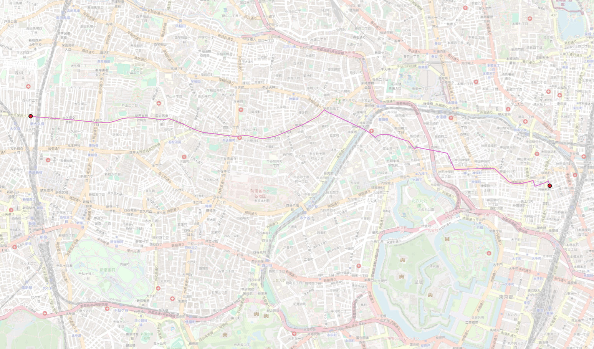
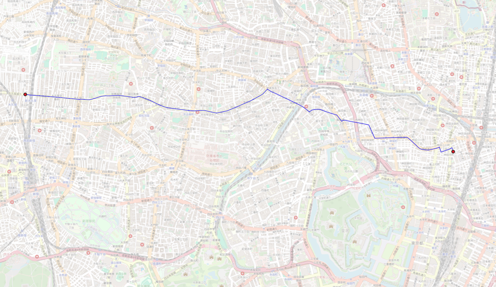

# Comparison betweem OSM and OvertureMap data with PgRouting

- [Comparison betweem OSM and OvertureMap data with PgRouting](#comparison-betweem-osm-and-overturemap-data-with-pgrouting)
- [Dataset creation](#dataset-creation)
- [Comparison](#comparison)

# Dataset creation

To create the two datasets, please refer to the documentation for each data type :

- OvertureMap : [OvertureMap_data.md (section Djikstra Algorithm)](./OvertureMap_data.md)

- OpenStreetMap : [OSM_PgRouting.md](./OSM_PgRouting.md)

# Comparison

I have tested using pgr_djikstra algorithm of pgrouting what was the shortest route between Shin-Okubo station and LocationMind.
I did not calculated the cost, but the results look quite similar as you can see in the following pictures:

**Route with OSM data**

**Route with OvertureMap data**

