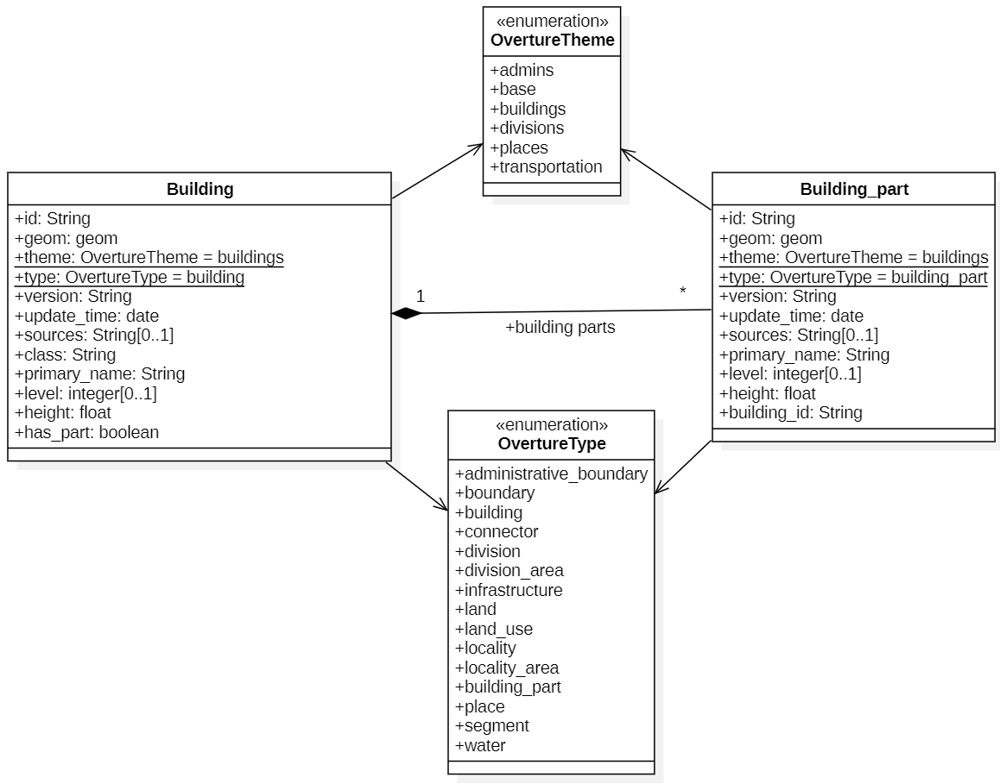
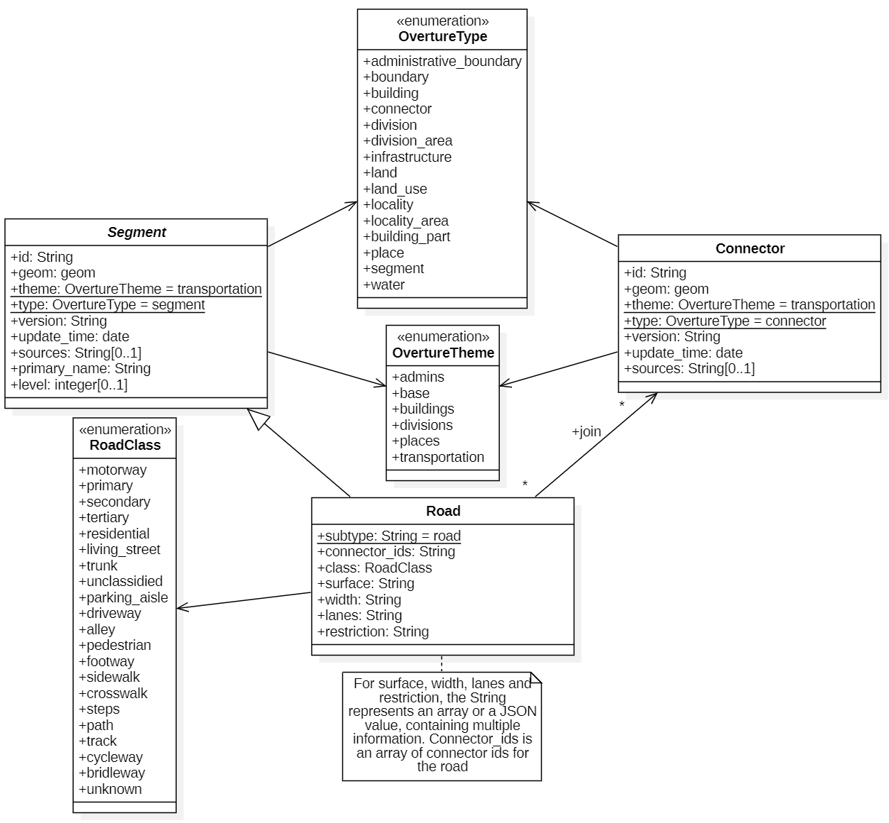

# Data modelisation for OSM and Overture Mqp buildings / roads

## Buildings model

The building model was mainly inspired by the [OvertureMap building model](https://docs.overturemaps.org/schema/reference/buildings/building).
To model it, one can use the Unified Model Language (UML) and the class diagram particularly, as shown in the following image :

A building can only have a limited type of class possible in theory, but there are more than 90 different classes, so it is not represented on the UML diagram.

## Road model

Once again, the model is mainly inspired by the [OvertureMap transportation model](https://docs.overturemaps.org/schema/reference/transportation/segment).
There is a difference though, as the road are parts of the segment data (it is a subtype of segment), and connector are necessary for routing algorithm.
The following image shows the class diagram for road and connector data.

