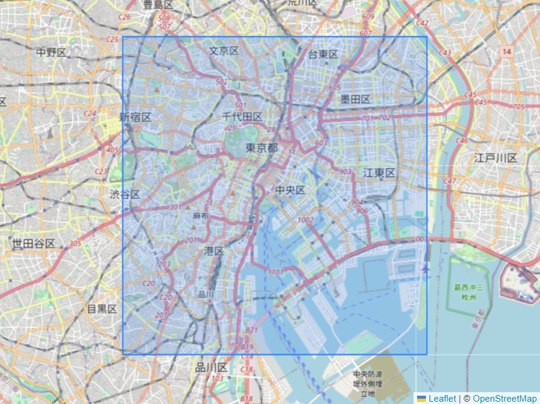
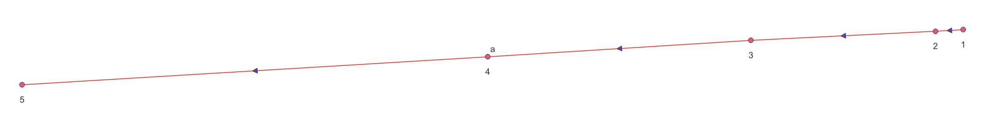
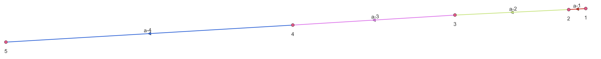
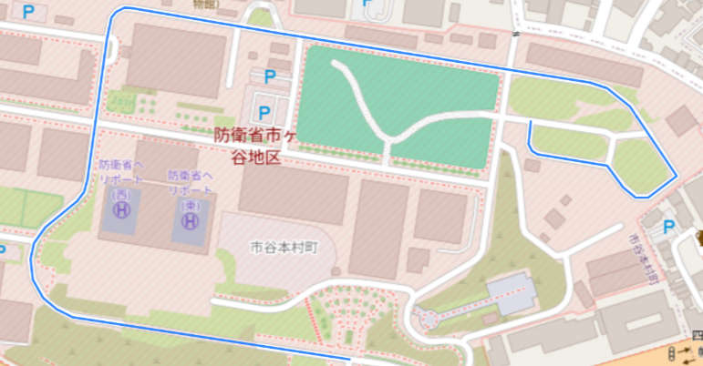
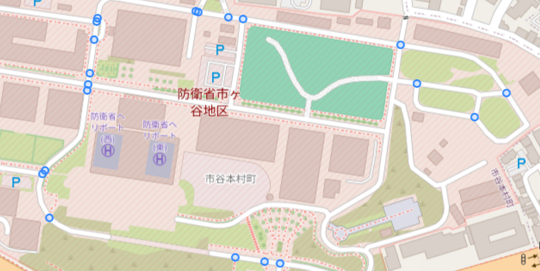
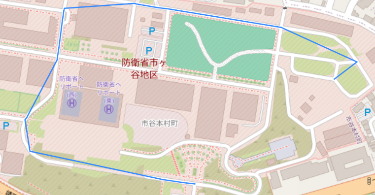
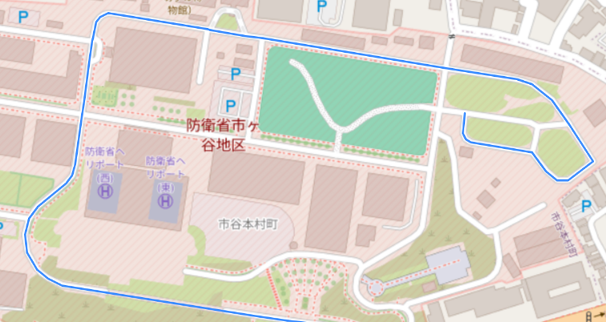
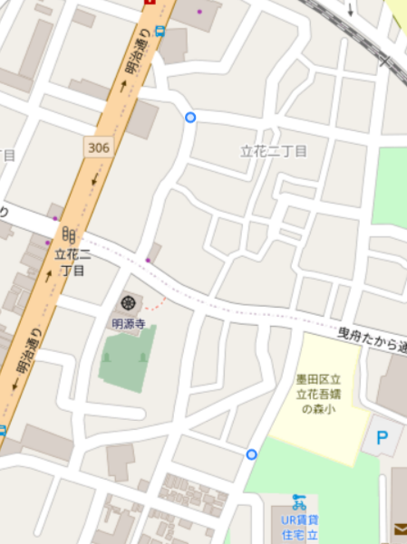
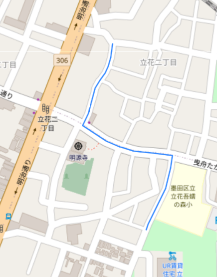

# OvertureMap Data integration - PgRouting test

- [OvertureMap Data integration - PgRouting test](#overturemap-data-integration---pgrouting-test)
- [Data integration](#data-integration)
	- [Downloading data](#downloading-data)
		- [OvertureMap Python tool](#overturemap-python-tool)
	- [Inserting data in the database](#inserting-data-in-the-database)
		- [Used dependencies](#used-dependencies)
		- [Python scripts using DuckDB](#python-scripts-using-duckdb)
		- [SQL Dumps](#sql-dumps)
- [PgRouting test](#pgrouting-test)
	- [Notes](#notes)
	- [Process explanation](#process-explanation)
	- [Tables creation](#tables-creation)
		- [bounding\_box table (not mandatory)](#bounding_box-table-not-mandatory)
		- [Extract data from the desired bbox](#extract-data-from-the-desired-bbox)
		- [roads\_connectors table](#roads_connectors-table)
		- [connectors\_road\_count table](#connectors_road_count-table)
		- [edge table](#edge-table)
		- [Join tables](#join-tables)
		- [edge\_with\_cost view](#edge_with_cost-view)
		- [vertice table](#vertice-table)
		- [Djikstra algorithm test](#djikstra-algorithm-test)


All the steps explained here have only been tested using Windows 11.

# Data integration

## Downloading data

### OvertureMap Python tool

To download the necessary data over Japan, it is possible to use the [overturemaps python tool](https://github.com/OvertureMaps/overturemaps-py).
With this tool, it is possible to restrict the download to a specific bbox. For the Japan, the bbox is : `122.7141754,20.2145811,154.205541,45.7112046`.

To download the tool, just run :

```python
pip install overturemaps
```

Then, we can download the data we want, in our case : *building*, *building_part*, *segment*, *connector* and *locality_area* (not use for the moment but it is good to have it). It is important to note that for the moment, the segment file only contains To download the data over Japan, run the following command in a terminal :

```console
overturemaps download --bbox=122.7141754,20.2145811,154.205541,45.7112046 -f geoparquet --type=building -o .\Data\OvertureMap\building\japan_building.parquet && overturemaps download --bbox=122.7141754,20.2145811,154.205541,45.7112046 -f geoparquet --type=building_part -o .\Data\OvertureMap\building_part\japan_building_part.parquet && overturemaps download --bbox=122.7141754,20.2145811,154.205541,45.7112046 -f geoparquet --type=connector -o .\Data\OvertureMap\connector\japan_connector.parquet && overturemaps download --bbox=122.7141754,20.2145811,154.205541,45.7112046 -f geoparquet --type=segment -o C:\Users\Mathis.Rouillard\Documents\Data\OvertureMap\segment\japan_segment.parquet && overturemaps download -f geoparquet --type=locality -o .\Data\OvertureMap\locality\japan_locality.parquet && overturemaps download -f geoparquet --type=locality_area -o .\Data\OvertureMap\locality_area\japan_locality_area.parquet
```

The architecture used here is a folder OvertureMap, and inside this folder, subfolders are created for each type of download.
Please make sur to put an existing path, otherwise the code will seem to work but an exception will be raised at the end, preventing the download to finish.
Relative path or absolute path can be used.

Downloading OvertureMap data over Japan is quite long and take approximatively 14 GB.

## Inserting data in the database

### Used dependencies

- **DuckDB** : Version 0.10.2. The best is to install it using pip : `pip install duckdb`

- **PostgreSQL** : Version 16.2. Download the latest version on the offical website : https://www.postgresql.org/download/windows/. Please be sure to install PostGIS as well (You can also download PgAdmin $ directly, it will be easier this way). It is a necessary dependecy.

- **PgAdmin** : Version 8.2. You can either install it with the same installer than PostgreSQL, or directly on the offical website : https://www.pgadmin.org/download/pgadmin-4-windows/

- **QGIS** : Version 3.36.2. QGIS was used to visualise data mainly. Download on the offical repository : https://download.qgis.org/downloads/.

### Python scripts using DuckDB

Before doing anything else, create a database and make sure that the PostGIS extension is installed.
You can check if it is install by running `SELECT PostGIS_version();`.
If it is not install, you can simply run `CREATE EXTENSION postgis;`.

To import data into PostgreSQL, we can use DuckDB.
DuckDB is a DBMS that is really easy to download and use, as it has no other dependencies.
Also, OvertureMap files are written with the GeoParquet format, and DuckDB can read quite easily theis format.
There are extensions provided by DuckDB to use PostgreSQL and PostGIS.

Each type of data (*building*, *segment* etc.) have, for the moment, an designed file script :

- **Building** : [building_integration.py](../Python/building_integration.py)

- **Building_part** : [building_part_integration.py](../Python/building_part_integration.py)

- **Connector** : [connector_integration.py](../Python/connector_integration.py)

- **Segment** : [road_integration.py](../Python/road_integration.py)

- **Locality** : [locality_integration.py](../Python/locality_integration.py)

The locality file is a little bit different because treatments are made in it to only keep the country entitity.
Otherwise, the process is the following :

1. Get the files to proceed. The path of these files is store in the `path_data` variable. Depending on where you run your python script, this path might need some change.

2. Load and install the necessary extension (`spatial` and `postgres`)

3. Connect to the database. You might need to adapt the connection parameter. Initially, the connection parameter are :

    - **dbname** = `overturemap`

    - **host** = `127.0.0.1`

    - **user** = `postgres`

    - **password** = `postgres`

4. The integration process starts :

    1. Describe files ;

    2. Create the table with explicit cast to store them into postgres. You can change the name of the table directly on the `CREATE TABLE` clause ;

    3. Create an index on the id ;

    4. Count the number of entity stored in the database ;

    5. Create a geom column and transform the `geom_wkt` column (containing the geom in WKT format) into a PostGIS geometry. To do so, it is necessary to run with DuckDB an SQL request that will be ran by PostgreSQL database and not DuckDB. This way, we can make use of PostGIS functions such as `ST_GeomFromText` for instance. We also create `theme` and `type` columns that we update at the same moment than the geometry ;

    6. Create a geometry index using PostGIS function again ;

The longest process for the moment was for segments, which took approximatively 6 hours.
For the buildings, 4 hours are necessary.
It is shorter for the connector (1 or 2 hours), and not long at all for the locality and building parts (few minutes only).

### SQL Dumps

If you only want to test the algorithm and see what OvertureMap data looks like, you can simply download and restore extract of the database for the center of Tokyo :

- Table `building_tokyo` : [building_tokyo.sql](../Data/SQL_Dump/building_tokyo.sql)
- Table `road_tokyo` : [road_tokyo.sql](../Data/SQL_Dump/road_tokyo.sql)
- Table `connector_tokyo` : [connector_tokyo.sql](../Data/SQL_Dump/connector_tokyo.sql)
- Table `bounding_box` : [bounding_box.sql](../Data/SQL_Dump/bounding_box.sql)

# PgRouting test

## Notes

[PgRouting](https://pgrouting.org/index.html) is an extension of PostgreSQL that provides geospatial routing functionnality.
It is commun to use routing with transportation data, and a lot of works have been done using OpenStreetMap (OSM) data with PgRouting, but not with OvertureMap.
The point of this section is to see if OvertureMap data is compatible with PgRouting, directly or not.

For faster results and to prevent PgRouting from crashing, the test have been made only on the center of Tokyo, with the following bbox : 



All the SQL scripts are also available in the *SQL_Scripts/OvertureMap_PgRouting* folder [here](../SQL_Scripts/OvertureMap_PgRouting). The codes are inspired from a review written by Mathieu MARGOLLE about Openstreetmap_h3 tool. The document is available [here](./Openstreetmap_h3_Test_Review.docx).

In this section, "road" and "connector" are used respectively to mentionned the original data of the segment and connector tables, whereas "edge" and "vertice" respectively correspond to final edges and vertices of the graph (with their own id, cost and reverse_cost for the edges etc.).
The two tables `road_tokyo` and `connector_tokyo` are used in the next sections.

## Process explanation

OvertureMap data are well structured, with roads corresponding to the roads without duplication, connectors exactly on the road and corresponding to a possible decision when crossing a road and it is possible to have information quite easily about the speed limit or other restrictions.
However, we cannot use the data directly with PgRouting because the road are not cut between each connector.
Also, no costs are created for each edges, and there are not enough information about the relation between edges and vertices.

Each road have a `connector_ids` parameter with all connectors sorted from the beginning of the road to the end.
To transform OvertureMap data into PgRouting compatible data, we need to cut the roads between two following connectors.
The images above show the initial data we have on one road and 5 connectors, and what we want to have as a result.

**Initial data**:



**Expected results**:



This is just an example and it does not explain the whole process.
We can split the process in the 5 following steps:

1. Create a new table that store for each road one row per connector, with the connector geometry and the position of the connector in the list.
It does not agregate the results, therefore a connector stored in two `connector_ids` parameter of different roads for instance will appear twice in the database.
Even with identical geometry, the attributs of the row will be different, as a row is related to a road.

2. Count, for each connector, the number of roads connected to it.
This table will then be used to create the edge table.

3. Create the edge table by cutting each road between two following connectors.
For each edge, we keep the initial id of the road and create another id in the format `road_id-i`, where i correspond to the index of the edge, ie `1` is the first one and `n-1` is the last one, with `n` being the number of connectors for the initial road.

4. Create join tables between edge ids / connector ids and an integer to be compatible with pgr_djikstra (currently it is impossible to run `pgr_djikstra` algorithm with string ids). We cannot do this process before, as each edge-id might change.

5. Creating the edge with cost view, by transforming the edge, source and target ids with their corresponding integer ids, and setting the cost / reverse cost of the edge depending on the value of the access parameter with the length of the road (using `ST_Length(geom::geography)` for accurate results).

These steps are not mandatory, there might be other ways to do this using SQL requests.
Also, it might be possible to change the OvertureMap graph using python, especially the geopandas package, but for the moment it has not been done.
What is important to keep in mind is that we only want to split the roads between connectors to have a routing graph.

## Tables creation

A python script has been made to facilate the tables creation process.
You can find it here : [OvertureMap_data_to_graph.py](../Python/OvertureMap_data_to_graph.py).

### bounding_box table (not mandatory)

The `bounding_box` table is not mandatory but can be convenient if one want to work with different areas.
The idea is to have a table that will store the different test areas to work easily with them.
To create the table, run the following SQL script :

```sql
DROP TABLE IF EXISTS public.bounding_box CASCADE;

-- Create table part
CREATE TABLE IF NOT EXISTS public.bounding_box
(
    id serial NOT NULL,
    geom geometry,
    wkt_geom character varying COLLATE pg_catalog."default",
    name character varying COLLATE pg_catalog."default",
    CONSTRAINT bounding_box_pkey PRIMARY KEY (id)
);

-- Id index
CREATE INDEX bounding_box_id_idx
ON bounding_box(id);

-- Geometry index
CREATE INDEX bounding_box_geom_idx
  ON public.bounding_box
  USING GIST (geom);
```

To create a bounding box (bbox), you can use this tool : https://boundingbox.klokantech.com/.
Select "OGC WKT" in the Copy & Paste area (in the bottom left corner) so you can store them later in the database.
Then, run this SQL code by replacing `wkt_geom` by your real WKT bbox and `Area name` by the name you want :

```sql
INSERT INTO public.bounding_box(
	geom, wkt_geom, name)
	VALUES (ST_GeomFromText('wkt_geom', 4326),
	'wkt_geom',
    'Area name');
```

### Extract data from the desired bbox

Once you have your bbox saved, it is necessary to extract the data of your bbox for the road and connector at least.
The code to extract buildings in the bbox is also given.
Feel free to change the name of these tables, or to only create views and not table if you want (By replacing `CREATE TABLE` by `CREATE OR REPLACE VIEW`), it is not important.
In this example, "_tokyo" will be added to each table name (because the bbox is for the center of Tokyo).
Please check before what is the id corresponding to your bbox, or you can change `WHERE box.id = 1` by `WHERE box.name = Area name`, but if the name i snot unique you will have two areas, which could prevent PgRouting from working.
The SQL script is given here :

**Buildings**
```sql
DROP TABLE IF EXISTS public.building_tokyo CASCADE;

CREATE TABLE public.building_tokyo AS
    SELECT b.id,
        b.geom,
        b.version,
        b.update_time,
        b.sources,
        b.primary_name,
        b.class,
        b.level,
        b.height
    FROM building b
    JOIN bounding_box box ON st_intersects(b.geom, box.geom)
    WHERE box.id = 1;
```


**Roads**
```sql
DROP TABLE IF EXISTS public.road_tokyo CASCADE;

CREATE TABLE public.road_tokyo
    SELECT
        r.id,
        r.geom,
        r.version,
        r.update_time,
        r.sources,
        r.primary_name,
        r.class,
        r.connector_ids,
        r.surface,
        r.width,
        r.lanes,
        r.restrictions
    FROM road r
        JOIN bounding_box box ON st_intersects(r.geom, box.geom)
    WHERE box.id = 1;
```


**Connectors**
```sql
DROP TABLE IF EXISTS public.connector_tokyo CASCADE;

CREATE TABLE public.connector_tokyo AS
    SELECT
        c.id,
        c.geom,
        c.version,
        c.update_time,
        c.sources
    FROM connector c
    JOIN bounding_box box ON st_intersects(c.geom, box.geom)
    WHERE box.id = 1;
```

In the rest of this section, those tables will be used with their name given here.
If you decide to give them another name, please change it everywhere.

### roads_connectors table

The `roads_connectors` table is created to have a link between a road and the connectors that are connected to it.
These connectors are stored in the `connector_ids` column initially.
Using `json_array_elements_text`, we can have a row per connector stored in connector_ids.
The SQL code is given here, and includes the index creations too :

```sql
DROP TABLE IF EXISTS public.roads_connectors CASCADE;

CREATE TABLE roads_connectors AS
	SELECT
		r.id AS road_id,
		cons.con_id AS connector_id,
		json_array_length(r.connector_ids) AS max_i,
		cons.i::integer AS i,
		r.class,
		c.geom AS geom,
		r.connector_ids,
		r.version,
		r.update_time,
		r.sources,
		r.primary_name,
		r.surface,
		r.width,
		r.lanes,
		r.restrictions
	FROM
		public.road_bbox_tokyo AS r, json_array_elements_text(r.connector_ids) WITH ORDINALITY cons(con_id, i)
	LEFT JOIN
		public.connector AS c ON cons.con_id = c.id
	WHERE r.class IS NOT null;

-- Index creation
CREATE INDEX roads_connectors_connector_road_idx
    ON public.roads_connectors USING btree
    (connector_id ASC NULLS LAST)
    INCLUDE(road_id);

CREATE INDEX roads_connectors_road_i_idx
    ON public.roads_connectors USING btree
    (road_id ASC NULLS LAST, i ASC NULLS LAST);
```

### connectors_road_count table

The `connectors_road_count` table is created to store, for each connector, the roads related to it.
The connector with only one road are not keep (it corresponds to errors because a connector is supposed to be a decision point, so it supposed to connect two or more roads)

```sql
DROP TABLE IF EXISTS public.connectors_road_count CASCADE;

CREATE TABLE connectors_road_count AS
SELECT connector_id, array_agg(road_id) AS roads, count(*) AS cnt
FROM roads_connectors
GROUP BY connector_id
HAVING count(*)>1;

-- Add primary key
ALTER TABLE public.connectors_road_count
    ADD PRIMARY KEY (connector_id);
```

### edge table

The `edge` table correspond to the edges of the final graph.
To create this table, we have to split each road between two successive connectors.
Because the connectors are sorted in the right order, we just have to take one connector and the preceeding one to have the two connectors.
Then, using PostGIS function such as `ST_Split` or `ST_Dump`, we can recreate the road between the two connectors.

To make the process easier and more understandable, we can create a function that will take one road and two connectors and return the road between the two points.
Because OvertureMap data has been processed before its release, each connector intersects the road, so we can use `ST_Intersects` on each lines returned by `ST_Split` to check which one is the road between the connectors.
The following code create the function that does this : 

```sql
CREATE OR REPLACE FUNCTION public.ST_SplitLineFromPoints(
line geometry,
point_a geometry,
point_b geometry
)
RETURNS geometry AS
$BODY$
WITH
    split AS (SELECT (ST_Split(
		line,
		ST_Multi( ST_Union( point_a, point_b)))
					) geom)
    SELECT (g.gdump).geom as geom FROM (
	SELECT ST_Dump(
		geom
	) AS gdump from split) as g
	WHERE ST_Intersects((g.gdump).geom, point_a) AND ST_Intersects((g.gdump).geom, point_b)
$BODY$
LANGUAGE SQL;

ALTER FUNCTION public.ST_SplitLineFromPoints(geometry, geometry, geometry)
    OWNER TO postgres;

COMMENT ON FUNCTION public.ST_SplitLineFromPoints(geometry, geometry, geometry)
    IS 'args: line, point_a, point_b - Returns a collection of geometries created by splitting a line by two points. It only returns the line that intersects the two points.';
```

It is possible to check if the function is working by running this code : 

```sql
SELECT * FROM public.ST_SplitLineFromPoints(
	ST_GeomFromText('LINESTRING (139.7855581 35.6845005, 139.7855128 35.6845205, 139.7854152 35.6846371, 139.7851802 35.6849181, 139.7851609 35.6849429, 139.7851239 35.6849834, 139.7849334 35.6852165, 139.7849138 35.6852404, 139.7848932 35.6852645, 139.7847645 35.685418, 139.7847448 35.6854385, 139.7847229 35.6854682, 139.784627 35.6855972, 139.7845593 35.6856838, 139.7845526 35.6857087)', 4326),
	ST_GeomFromText('POINT(139.7851609 35.6849429)', 4326),
	ST_GeomFromText('POINT(139.7854152 35.6846371)', 4326)
);
```

**HOWEVER**, this function could be better because if a road cross two connectors twice, we will have two rows in the result and it will probably not work.

With this function, we can create the edge table :

```sql
DROP TABLE IF EXISTS public.edge CASCADE;

CREATE TABLE edge AS
SELECT
	road_id AS original_id,
	CASE
		WHEN n = 1 AND "end" = max_i THEN road_id
		ELSE road_id || '-' || CAST(n AS character varying)
	END AS "id",
	"source",
	target,
	-- GEOMETRY CREATION
	ST_AsText(ST_SplitLineFromPoints(r.geom, t.first_geom, t.second_geom)) AS wkt,
    ST_SplitLineFromPoints(r.geom, t.first_geom, t.second_geom) AS geom,
    ST_Length(ST_SplitLineFromPoints(r.geom, t.first_geom, t.second_geom)::geography) AS len,
	t."class",
	t."version",
	t.update_time,
	t.sources,
	t.primary_name,
	t.surface,
	t.width,
	t.lanes,
	t.restrictions
FROM (
	SELECT
		road_id,
		max_i,
		row_number() OVER cons -1 AS n,
		lag(connector_id) OVER cons AS "source",
		connector_id AS target,
		lag(geom) OVER cons AS first_geom,
		geom AS second_geom,
		lag(i) OVER cons AS "start",
		i AS "end",
		"class",
		"version",
		update_time,
		sources,
		primary_name,
		surface,
		width,
		lanes,
		restrictions
	FROM roads_connectors
	LEFT JOIN connectors_road_count USING (connector_id)
	WINDOW cons AS (PARTITION BY road_id ORDER BY i ASC ROWS 1 PRECEDING)
	ORDER BY road_id ASC
) t

LEFT JOIN road_tokyo as r ON road_id = id
WHERE n>0;

-- Add a primary key
ALTER TABLE public.edge
    ADD CONSTRAINT edge_pkey PRIMARY KEY (id);

-- Index creation
CREATE INDEX edge_geom_idx
    ON public.edge USING gist (geom);

CREATE INDEX edge_original_id_idx
    ON public.edge USING btree
    (original_id ASC NULLS LAST)
    TABLESPACE pg_default;
```

To ensure that each road segment is unique, we recreate an id using the original id and adding "-i" at the end, where i is an index corresponding to the current connector of the connector ids list.

We could think that an easier way for recreating the road segment would be to just create the line between two connectors using `ST_MakeLine` for instance, but it does not work because the connectors correspond to decision point and not points used to create the road.
The next pictures illustrate this :

**Initial road**



**Initial connectors**



**Results with `ST_MakeLine`**



**Results with the code provided before**




### Join tables

PgRouting algorithms only work with integer id, but OvertureMap ids are character varying.
For that reason, we have to create join tables to connect the OvertureMap ids with integer ids.
We have to make one join table per data type, i.e. road and connector.
To do so, we can just make a table with two columns, one that we will fill with existing ids and the other automatically incremented by PostgreSQL, using a `serial` type.
It is good to also add an unique constraint on the OvertureMap id column to prevent repeated values.
Because we create segments for each road, we have to create the join tables using the edges id (the new one), but we can use the connector table for the join (no other connectors are created).

**Edges**
```sql
DROP TABLE IF EXISTS public.join_edge_str_to_int CASCADE;

CREATE TABLE IF NOT EXISTS public.join_edge_str_to_int
(
    id bigserial PRIMARY KEY,
    edge_id character varying NOT NULL,
    CONSTRAINT unique_edge_id UNIQUE (edge_id)
);

ALTER TABLE IF EXISTS public.join_edge_str_to_int
    OWNER to postgres;

-- Index creation
CREATE INDEX join_id_idx_edge_table
    ON public.join_edge_str_to_int USING btree
    (id ASC NULLS LAST);

CREATE INDEX join_edge_id_idx
    ON public.join_edge_str_to_int USING btree
    (edge_id ASC NULLS LAST);
```

And then insert the values :

```sql
INSERT INTO public.join_edge_str_to_int(edge_id)
SELECT id FROM edge
ORDER BY id ASC;
```

**Connectors**
```sql
DROP TABLE IF EXISTS public.join_connector_str_to_int CASCADE;

CREATE TABLE IF NOT EXISTS public.join_connector_str_to_int
(
    id bigserial PRIMARY KEY,
    connector_id character varying NOT NULL,
    CONSTRAINT unique_connector_id UNIQUE (connector_id )
);
ALTER TABLE IF EXISTS public.join_connector_str_to_int
    OWNER to postgres;

-- Index creation
CREATE INDEX join_id_idx_connector_table
    ON public.join_connector_str_to_int USING btree
    (id ASC NULLS LAST);

CREATE INDEX join_connector_id_idx
    ON public.join_connector_str_to_int USING btree
    (connector_id ASC NULLS LAST);
```

We can then insert the values for all the connectors directly (it is longer but more efficient) :

```sql
INSERT INTO public.join_connector_str_to_int(connector_id)
SELECT id FROM connector
ORDER BY id ASC;
```


### edge_with_cost view

The `edge_with_cost` view correspond to the edge view with cost and reverse cost for each edge.
It is necessary for algorithm such as `pgr_djikstra`, and for routing algorithm in general.
To calculate the cost and reverse cost, we take information on the restrictions parameter to see if it is possible to go forward / backward. If it is denied, the cost is negative, meaning that it is not possible to go there. Otherwise, the associated cost is the length of the segment.
The cost could be improved in many ways : including a speed limit, checking when the restrictions really happens, calculate the length in a projected SRID because it is currently calculated in WGS84...
But the point of this test is not to have an accurate cost, just to see if it would work.
We are only interested in roadway (meaning you can drive on it), not cycleway or pedestrians way.
For that reason, we check if the class is good or not.

The following sql code create the view :

```sql
DROP VIEW IF EXISTS public.edge_with_cost CASCADE;

CREATE OR REPLACE VIEW public.edge_with_cost
AS
SELECT
	j.id,
	s.id AS "source",
	t.id AS "target",
	CASE
		WHEN restrictions -> 'access' -> 0 ->> 'access_type' = 'denied'
		AND restrictions -> 'access' -> 0 -> 'when' ->> 'heading' = 'forward'
		THEN '-1'
		ELSE len
	END AS cost,
	CASE
		WHEN restrictions -> 'access' -> 0 ->> 'access_type' = 'denied'
		AND restrictions -> 'access' -> 0 -> 'when' ->> 'heading' = 'backward'
		THEN '-1'
		ELSE len
	END AS reverse_cost,
	class,
	e.geom
FROM edge AS e

LEFT JOIN join_connector_str_to_int AS s ON source=s.connector_id
LEFT JOIN join_connector_str_to_int AS t ON target=t.connector_id
LEFT JOIN join_edge_str_to_int AS j ON e.id=j.edge_id
```


### vertice table

The `vertice` table is almost a copy of the `connector` table, except that the id are integers taking from the join tables and not from the `connector` table.
Also, the edges (coming from the `edge_with_cost` table, so not all the edges) coming in and out of each connector are stored in that table too.

The following code create the table and the geometry index :

```sql
DROP TABLE IF EXISTS vertice CASCADE;

CREATE TABLE vertice AS
SELECT j.id AS id, in_edges, out_edges, c.geom
FROM connectors_road_count AS cnt
LEFT JOIN connector c ON cnt.connector_id = c.id
LEFT JOIN join_connector_str_to_int AS j ON j.connector_id = cnt.connector_id
LEFT JOIN (
	SELECT target, array_agg(id) AS in_edges
	FROM edge_with_cost
	WHERE target IS NOT NULL GROUP BY target) ei ON j.id = target
LEFT JOIN (
	SELECT "source", array_agg(id) AS out_edges
	FROM edge_with_cost
	WHERE "source" IS NOT NULL GROUP BY "source") eo ON j.id = "source";

-- Add primary key
ALTER TABLE public.vertice
    ADD CONSTRAINT vertice_pkey PRIMARY KEY (id);

-- Create index
CREATE INDEX vertice_geom_idx
    ON public.vertice USING gist (geom);
```


### Djikstra algorithm test

Finally, all the necessary tables are ready now.

To run the djikstra algorithm, the pgrouting extension is needed.
To download it run the following code :

```sql
CREATE EXTENSION pgrouting CASCADE;
```

Then, choose 2 connectors, copy their ids and run the following request to get the integer ids that will be needed for the Djikstra algorithm :

```sql
SELECT * from join_connector_str_to_int
WHERE connector_id = '08f2f5a325655b2e043fff1f4db6e934' OR connector_id = '08f2f5a32562c819043fef82fd45f23d';
```

Be careful to choose connectors connected to driving roads, not sidewalks or other types, otherwise it will not work.

Then, copy the integer ids and run the following request :

```sql
SELECT seq, edge, dij."cost", geom
FROM pgr_dijkstra(
    'SELECT id, source, target, cost, reverse_cost
    FROM edge_with_cost
	WHERE class NOT IN (
		''alley'',
		''pedestrian'',
		''footway'',
		''sidewalk'',
		''crosswalk'',
		''steps'',
		''path'',
		''track'',
		''cycleway'',
		''bridleway'');'::text,
    8024959,
	8024811,
	directed := true) dij
JOIN edge_with_cost AS e ON edge = e.id;
```

The result should be the shortest path between the two connectors.
For this example, the connectors were : 

.

The result was :


