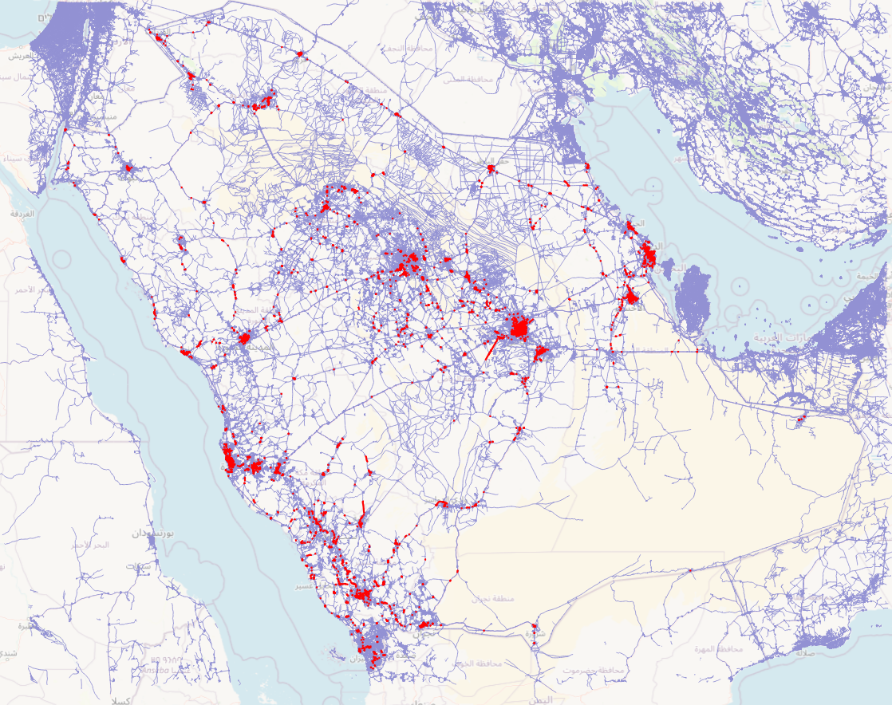
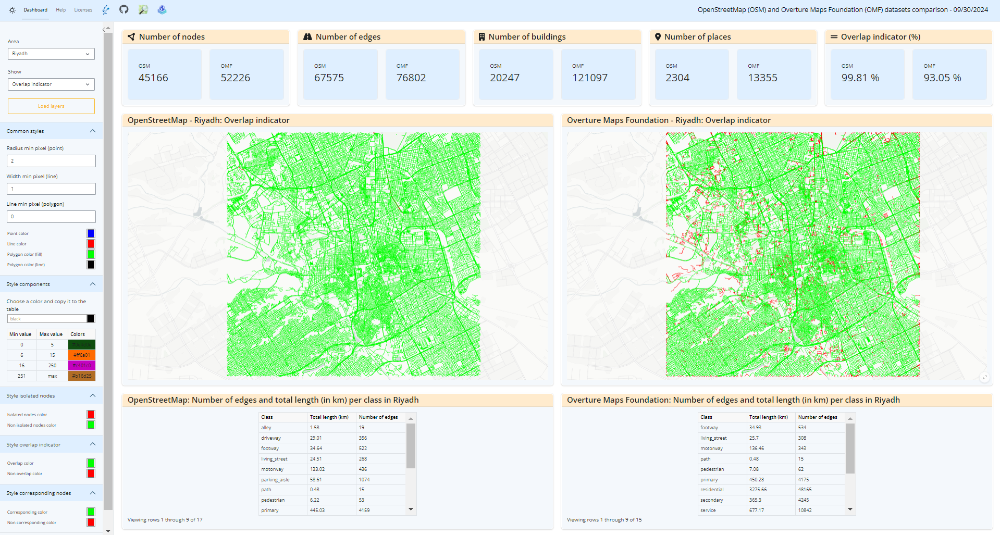
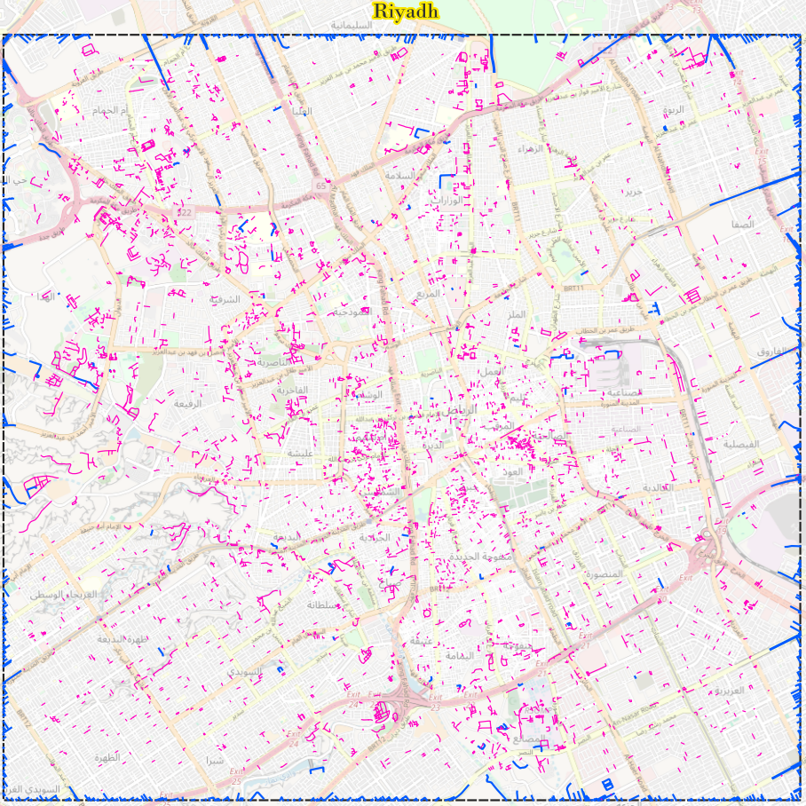
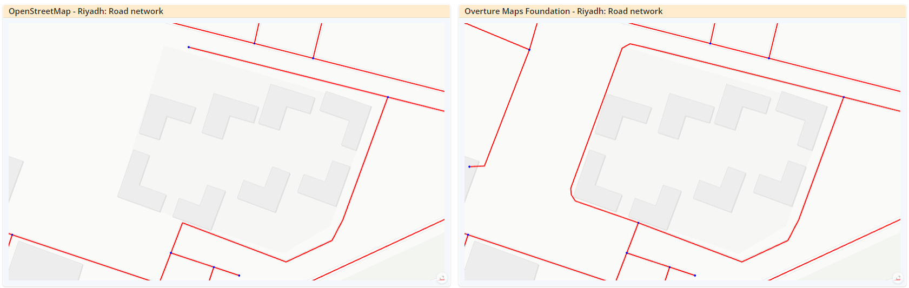
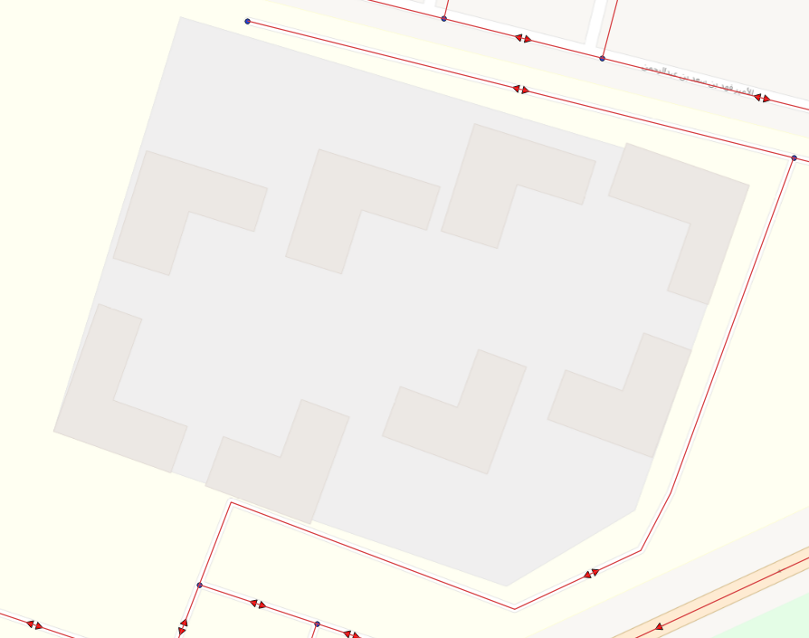
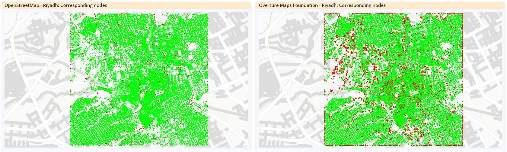
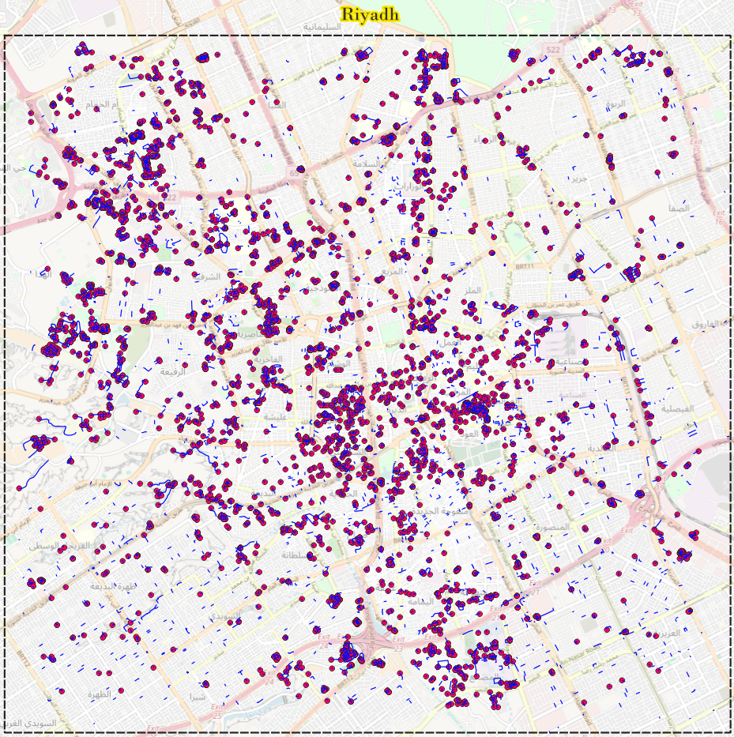

# Comparing Overture Maps Foundation and OpenStreetMap transportation data in Riyadh, Saudi Arabia

## Introduction

Overture Maps Foundation (OMF) recently released a new version of their dataset (2024-9-18.0 release) and announced the addition of 1000 kilometres of new roads sourced from TomTom dataset in Saudi Arabia.
To determine if those additions would influence the different quality criteria used to assess the quality of OMF and OpenStreetMap (OSM) transportation data, tests have been conducted in Riyadh, Saudi Arabia.

The tests were performed using the 2024-9-18.0 release from Overture Maps Foundation, and data up yo 2024/08/31 for OpenStreetMap.

## Global test area

First, to examine how TomTom data is distributed across Saudi Arabia and select an appropriate test area (as it is not feasible to assess the quality across the entire dataset for Saudi Arabia), OMF data was downloaded for all of Saudi Arabia.
The figure below shows the roads from TomTom in red and the roads from OpenStreetMap in purple in Saudi Arabia; the background map is sourced from OpenStreetMap.



Given the distribution of TomTom roads, the test area was selected in Riyadh, the capital of Saudi Arabia.
Particularly, the bounding box and name of the area used in the [bboxs.json](../Data/bboxs.json) file were:

```json
{
    "bboxs" : [
        {
            "bbox":"46.62470434,24.56755775,46.78428180,24.70689399",
            "area":"Riyadh"
        }
    ]
}
```

## Results in Saudi Arabia

The tests were conducted on 27/09/2024 at 16:41, using the 2024-09-18.0 release of Overture Maps Foundation data and the OpenStreetMap data up to 2024-08-31.

### Value of the criteria

| **Criterion**                                | **Area**           |   **OSM Value** |   **OMF Value** |   **Difference (abs)** |
|----------------------------------------------|--------------------|-----------------|-----------------|------------------------|
| **1. Number of nodes**                       | *Riyadh*           |     45166       |      52226      |            7060        |
| **2. Number of edges**                       | *Riyadh*           |     67575       |      76802      |            9227        |
| **3. Total length (km)**                     | *Riyadh*           |      5311       |       5666      |             355        |
| **4. Number of connected components**        | *Riyadh*           |        48       |         59      |              11        |
| **5. Number of strong connected components** | *Riyadh*           |       411       |        571      |             160        |
| **6. Number of isolated nodes**              | *Riyadh*           |        11       |          0      |              11        |
| **7. Overlap indicator (%)**                 | *Riyadh*           |        99.81    |         93.05   |               6.76     |
| **8. Number of corresponding nodes**         | *Riyadh*           |     43886       |      43886      |               0        |
| **9. Percentage of corresponding nodes (%)** | *Riyadh*           |        97.17    |         84.03   |              13.14     |

***Table 1: Value of the criteria for Riyadh Area***

### Total length and number of entities per class for each dataset

| class         |   OSM - Total length (km) |   OSM - Number of entities |   OMF - Total length (km) |   OMF - Number of entities |
|---------------|---------------------------|----------------------------|---------------------------|----------------------------|
| None          |                      0    |                          0 |                      1.34 |                         20 |
| alley         |                      1.58 |                         19 |                      1.61 |                         20 |
| driveway      |                     29.01 |                        356 |                     28.58 |                        419 |
| footway       |                     34.64 |                        522 |                     34.78 |                        530 |
| living_street |                     24.51 |                        268 |                     25.53 |                        302 |
| motorway      |                    133.03 |                        436 |                    136.24 |                        341 |
| parking_aisle |                     58.61 |                       1074 |                     56.76 |                       1086 |
| path          |                      0.48 |                         15 |                      0.48 |                         15 |
| pedestrian    |                      6.22 |                         53 |                      7.08 |                         62 |
| primary       |                    445.04 |                       4159 |                    450.3  |                       4175 |
| residential   |                   3140.02 |                      43295 |                   3275.52 |                      48161 |
| secondary     |                    361.18 |                       4031 |                    365.3  |                       4245 |
| service       |                      0    |                          0 |                    589.54 |                       9309 |
| sidewalk      |                      0    |                          0 |                      0.15 |                          4 |
| steps         |                      1.31 |                         58 |                      1.29 |                         55 |
| tertiary      |                    563.85 |                       6540 |                    573.89 |                       7071 |
| track         |                      0.81 |                         10 |                      0.84 |                         11 |
| trunk         |                     38.33 |                        156 |                     39.33 |                        133 |
| unclassified  |                     73.58 |                        718 |                     76.36 |                        834 |
| unknown       |                    398.52 |                       5865 |                      0.56 |                          9 |

***Table 2: Total length and number of entities per class in Riyadh Area***

### Total length and number of entities per source in OMF data

| Source | Number of entities | Total length (km) |
|---|---|---|
| OpenStreetMap | 74028 | 5938.03 |
| TomTom | 5243 | 307.56 |

***Table 3: Total length and number of entities per source in Riyadh Area***

### Focus on interesting values

#### Total length

TomTom data has been added to OMF dataset and, as shown in [table 3](#total-length-and-number-of-entities-per-source-in-omf-data), there are more than 300 kilometres of roads that have been added.
There are always slight differences in the total length for both datasets as the data itself is integrated differently.
However, those differences are usually less than 20 kilometres.
The total length difference between the two dataset is 355 kilometres, which is coherent with the roads added from TomTom.

#### Overlap indicator

As a reminder, the overlap indicator corresponds to the proportion of roads from one dataset that are overlapping roads in another dataset.

The results were 99.81% for OSM (i.e. 99.81% of roads present in OSM dataset are also in OMF dataset) and 93.05% for OMF.
Usually, the differences are less than 3%, as OMF dataset used to integrate only OSM roads.
Here, the difference is of 6.76%, with, a priori, more roads present only in OMF dataset.
This result is visible, so here is an overview of the overlap indicator to try to understand if the differences are only because of TomTom roads or not.



As predicted, there are not many roads lacking in OMF dataset (as roads on the left map are almost only green), but there are a lot of roads lacking in OSM dataset.
Except for the roads close to the extent of the bounding box (that are recreated when integrating the data, and therefore cannot be present in OSM dataset), it might be interesting to see the percentage and total length of the roads lacking in OSM.
The percentage, number of entities and total length in kilometre of non-overlapping roads are given in the following table:

| Source | Number of entities | Total length (km) | Percentage (from) |
|---|---|---|---|
| OpenStreetMap | 884 | 85.94 | 2.00 |
| TomTom | 5243 | 307.56 | 5.00 |

***Table 4: Detailed about non overlaping roads in OMF dataset per source***

All the roads from TomTom are missing in OpenStreetMap.
In the `sources` attribute of OMF data, there are never (at least for this example) two different sources for one feature, so it makes sense that roads from TomTom are missing from OSM.
It is possible to see how the roads are distributed in OMF dataset.



In this image, the blue roads come from OSM, and the pink one come from TomTom.
For OSM roads (i.e. the blue ones), most of them are located around the extent of the area, which is always the case for the overlap indicator in OMF dataset.
The rest of them, located inside the area, are usually roads whose source is from OSM, but that do not seem to appear in OSM dataset.
Indeed, those roads are usually not closed in OSM dataset, but for some reason, they are closed in OMF dataset.
The following image shows an example of this.



It is not indicated in these sources that other data are included, and even when checking directly on OSM website (to access the latest features), the road is indeed missing in OSM.
Overture Maps Foundation mentioned that, for the last release, they have "added more than 1000km of non-OSM road segments from TomTom to improve data in Saudi Arabia and fix a coverage gap" (see [here](https://docs.overturemaps.org/release/latest/#transportation)).
It is possible that these roads were added from TomTom in order to "fix a coverage gap".
To try to understand where this change might have come from, one can download OMF data from an older version.
The following image shows OMF data from the 2024-08-20.0 release in the same area as the previous image.



It seems that OMF used TomTom data to fix the coverage gap in this area, but there is no way to confirm this other than comparing the dataset with OpenStreetMap's dataset itself.
For your information, the JSON contained for the sources for the road presumably added from TomTom data is:

```json
sources = [
    {
        "confidence": null,
        "dataset": "OpenStreetMap",
        "property": "",
        "record_id": "w638620991@3",
        "update_time": "2021-05-18T20:10:18Z"
    }
]
```

To conclude for the roads, it is quite visible that the addition of roads from other datasets should make the comparison between several datasets and OMF more interesting, as it allows one to see where the data were added.
However, it is interesting to see that the work done with the roads does not seem to be transparent for a random user, as one needs to check specifically which roads are contained in both dataset in order to find out that roads from OSM were modified using TomTom data.

#### Corresponding nodes

The idea for the corresponding nodes is similar to the roads.
There are 43886 corresponding nodes, resulting in 97.17% of corresponding nodes for OSM and 84.03% for OMF; hence a difference of 13.14% and 8340 nodes in OMF dataset that are not corresponding nodes.
The difference itself is not unusual, as there can be an significant difference in corresponding nodes, but it is interseting to see how the corresponding nodes are distributed over OMF area, especially to see if there are many nodes around TomTom roads.
The following image gives an overview of the corresponding nodes in Riyadh.



To determine if the non-corresponding nodes are related to TomTom roads, it is possible to select the corresponding nodes that are only intersecting TomTom roads.
To do so, SQL queries are sufficient.
This still relies on one hypothesis: The dataset of the first element in the `sources` attribute corresponds to the dataset where the road originates.
This hypothesis has been verified on the test dataset using an SQL query:

```sql
SELECT e.sources, elem
FROM omf.edge_with_cost_riyadh AS e, json_array_elements(e.sources) AS elem
WHERE e.sources -> 0 ->> 'dataset' != elem ->> 'dataset'
```

As this query results in 0 rows, this hypothesis is verified for the test dataset.

Then, it is possible to select the non-corresponding nodes only with this SQL request:

```sql
WITH tomtom_roads AS (
	SELECT * FROM omf.edge_with_cost_riyadh
	WHERE sources -> 0 ->> 'dataset' = 'TomTom'
),
other_roads AS (
	SELECT * FROM omf.edge_with_cost_riyadh AS e
	WHERE e.id NOT IN (SELECT t.id FROM tomtom_roads AS t ORDER BY t.id)
),
non_corresponding_nodes AS (
	SELECT * FROM results.corresponding_nodes_riyadh_omf
	WHERE intersects IS False
),
non_co_nodes_intersect_osm AS (
	SELECT n.id FROM non_corresponding_nodes AS n
	JOIN other_roads AS o ON public.ST_Intersects(n.geom, o.geom)
)
SELECT DISTINCT ON (n.id) n.* FROM non_corresponding_nodes AS n
JOIN tomtom_roads AS t ON public.ST_Intersects(t.geom, n.geom)
WHERE n.id NOT IN (SELECT nc.id FROM non_co_nodes_intersect_osm AS nc ORDER BY nc.id);
```

This request results in 3092 non-corresponding nodes that are only intersecting TomTom roads, meaning that 37% of the non-corresponding nodes are only in TomTom dataset.
Visually, it looks like this:



To check how many corresponding nodes are intersecting at least one TomTom road, it is possible to run this query:

```sql
WITH tomtom_roads AS (
	SELECT * FROM omf.edge_with_cost_riyadh
	WHERE sources -> 0 ->> 'dataset' = 'TomTom'
),
non_corresponding_nodes AS (
	SELECT * FROM results.corresponding_nodes_riyadh_omf
	WHERE intersects IS False
)
SELECT DISTINCT ON (n.id) n.* FROM non_corresponding_nodes AS n
JOIN tomtom_roads AS t ON public.ST_Intersects(t.geom, n.geom)
ORDER BY n.id
```

It results in 7160 corresponding nodes, or 85.9% of the non-corresponding nodes, that are intersecting TomTom roads.

It is hard to conclude, as other results for corresponding nodes sometimes show an important difference of more than 20%.
However, as more than 85% of the non-corresponding nodes are intersecting with TomTom roads, it could be possible to check if those nodes existed in previous releases or if they were added only with the new roads from TomTom, as a connector in OMF dataset corresponds to a possible routing decision.

### Attributes

It is possible to verify if the different attributes are filled for TomTom roads by running an SQL query like this:

```sql
SELECT * FROM omf.edge_with_cost_riyadh
WHERE sources -> 0 ->> 'dataset' = 'TomTom'
AND (
	road_surface IS NOT NULL OR
	road_flags IS NOT NULL OR
	min_speed IS NOT NULL OR
	max_speed IS NOT NULL OR
	width_rules IS NOT NULL OR
	prohibited_transitions IS NOT NULL OR
	level_rules IS NOT NULL OR
	name IS NOT NULL
)
```

The result is only 88 rows for more than 5000 entities in total.
When looking at the data, it seems that only the `level_rules` has been filled, all with `['is_link']` as a value.
Therefore, TomTom data appear to have less attribute information than OpenStreetMap data.

## Conclusion

This test on Riyadh area highlights important results regarding the relevance of the criteria.
The criteria related to comparing the two datasets are good first steps in order to observe the addition of TomTom roads in Overture Maps Foundation dataset and assess if it is possible to use them.
The overlap indicator seems to have shown that all roads added from TomTom are, as expected, absent from OpenStreetMap dataset.
However, it has also shown that some modifications to OpenStreetMap roads have probably been made using TomTom data, but without any information in the data itself.
This might be an issue that could be raised with Overture Maps Foundation, as it should be transparent for a user to see where the data comes from, especially regarding attribution and licences of the data.

For the corresponding nodes, it is more complicated to conclude directly, but generally, the results are similar, as nodes have been created for routing decision points, resulting in nodes that are not present in OpenStreetMap.
However, it could be possible to verify whether those nodes existed before or not, but it is not necessary, as the results provided here already show that adding data to Overture Maps Foundation makes this analysis more intereseting.