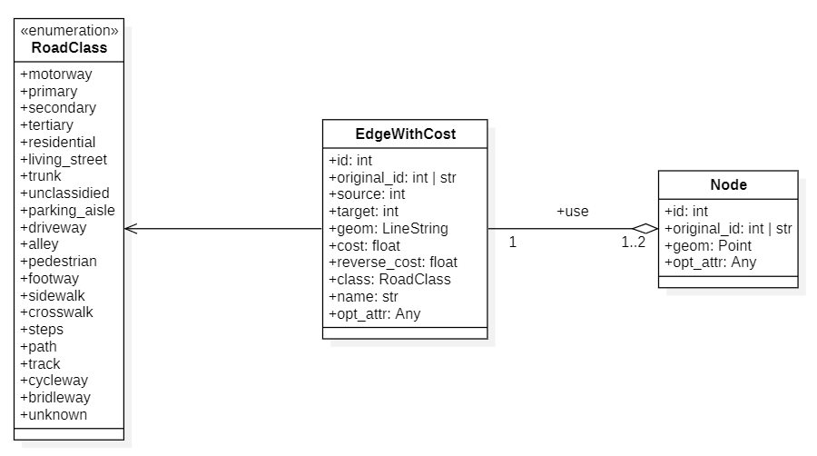

# Developer Documentation

This documentation provides information on how to modify various scripts to either change datasets or add criteria, for instance.

- [Developer Documentation](#developer-documentation)
- [Data Integration Process](#data-integration-process)
  - [Adding a new dataset](#adding-a-new-dataset)
    - [Mapping Transportation Data to the Common Model](#mapping-transportation-data-to-the-common-model)
    - [Building and Places Data](#building-and-places-data)
    - [Changes in Python Scripts](#changes-in-python-scripts)
      - [`main.py` File](#mainpy-file)
      - [`graph_analysis.py` File](#graph_analysispy-file)
  - [Adding a new criterion](#adding-a-new-criterion)
  - [Adding a new theme](#adding-a-new-theme)
- [GeoDataCompare](#geodatacompare)
  - [Change input datasets](#change-input-datasets)
  - [Adding a new criterion to the Dashboard](#adding-a-new-criterion-to-the-dashboard)
  - [Adding a new theme to the DashBoard](#adding-a-new-theme-to-the-dashboard)
    - [Creating the new theme class](#creating-the-new-theme-class)
    - [Adding elements to the DashBoard](#adding-elements-to-the-dashboard)

# Data Integration Process

The entire process has been created using only [OpenStreetMap](https://www.openstreetmap.org/) (OSM) and [Overture Maps Foundation](https://overturemaps.org/) (OMF) data. Consequently, the processes and dashboard have been designed according to these datasets. This is particularly evident in the variable names (e.g., `osm` or `omf`, rather than `datasetA` and `datasetB`).

However, if one wishes to use a different dataset as an input, it is possible to do so, and this is explained in this section, as well as how to add a new criterion or theme. Changes related to the dataset are detailed in the [GeoDataCompare](#geodatacompare) section.

## Adding a new dataset

### Mapping Transportation Data to the Common Model

If another dataset is used, two main issues must be resolved:

- How to download transportation, building, and places data for a specific bounding box.

- How to map this data to the common model.

The first question cannot be answered universally, as it depends on the input dataset. However, some methods for mapping data to the common model can be developed. The common model for transportation data is illustrated in the following UML diagram:



It is essential to map data to this model for the dashboard and quality assessment to function properly. To do this, several attributes are required (with these names):

**For Edge with Cost Layers**:

- `id`: Unique integer identification for each edge.

- `original_id`: ID in the original dataset (not mandatory).

- `source`: Foreign key corresponding to the source node of the edge.

- `target`: Foreign key corresponding to the target node of the edge.

- `geom`: LineString geometry of the edge.

- `cost`: Cost to travel from source to target (can be the length of the edge or the travel time). Must be set to `-1` if there is no path from the source to the target.

- `reverse_cost`: Cost to travel from target to source (can be the length of the edge or the travel time). Must be set to `-1` if there is no path from the source to the target.

- `class`: Class of the road, used to compare results according to this attribute.

- `name`: Name of the road (not mandatory).

- `opt_attr`: Any other optional attribute to retain.

**For Node Layers**:

- `id`: Unique integer identification for each node.

- `original_id`: ID in the original dataset (not mandatory).

- `geom`: Point geometry of the node.

- `opt_attr`: Any other optional attribute to retain.

Once the mapping between the dataset model and this model is determined, it is advisable to create a separate file for integrating data for this dataset. Depending on the dataset, mapping to this model may be straightforward or quite challenging. Consult the [PgRouting documentation](https://docs.pgrouting.org/latest/en), especially functions related to the [topology of the graph](https://docs.pgrouting.org/latest/en/topology-functions.html), to create a graph corresponding to this model. Additionally, consider referring to the [osm.py](../Python/Assessment/osm.py) and [omf.py](../Python/Assessment/omf.py) files for ideas on creating your road network.

### Building and Places Data

For these two themes, the process is simpler as there are currently no quality criteria for these layers that need to be calculated beforehand. However, you will still need to download them for a specific area. Although there is no schema for their model, these attributes are mandatory:

**For Building Layers**:

- `id`: Unique integer identification for each building.

- `geom`: Polygon geometry of the building.

- `class`: Class of the building, used to create the dataframe displayed in the dashboard.

**For Place Layers**:

- `id`: Unique integer identification for each place.

- `geom`: Point geometry of the place.

- `category`: Category of the place, used to create the dataframe displayed in the dashboard.

Additional attributes can be included for both layers.

### Changes in Python Scripts

After completing the data download and integration process into the database, modifications to two files will be necessary:

- [main.py](#mainpy-file): For integrating data into the database automatically from bounding boxes.

- [graph_analysis.py](#graph_analysispy-file): For calculating criteria on the different layers.

The process for adding a new area to the bounding box file is explained in the [user documentation](user-doc.md#adding-areas).

#### `main.py` File

The new Python script created to download data should only provide functions to be used in the [main.py](../Python/Assessment/main.py) file. Ideally, three functions should be created in the new Python script:

- `createGraphFromBbox`: For creating edge with cost and node layers from a specific bounding box.

- `createPlaceFromBbox`: For creating place layers from a specific bounding box.

- `createBuildingFromBbox`: For creating building layers from a specific bounding box.

These functions already exist for OSM and OMF data integration processes. Creating them in a new script will simplify the process. These functions would likely require at least three parameters:

- `bbox:str`: A bounding box for the area, in the format 'W, S, E, N' (as used in other functions).

- `area:str`: Name of the area.

- `schema:str`: Name of the schema to save the layer to.

Indeed, with functions like these, adding a new dataset to this process becomes straightforward:

1. Import the dataset into the Python file.

2. Add the schema name with an appropriate variable name, such as `schema_<dataset>` [here](../Python/Assessment/main.py#L18).

3. For each theme, add an `if / else` statement to check if the layer has already been created.

4. Finally, add the function to download data for the theme inside the `if` statement.

The final file should resemble the following (`...` indicates existing code):


```python
import mydataset

...

schema_dataset = 'dataset'

...

### Graph ###
## Dataset
# Check if the process has already been done
if not (utils.isProcessAlreadyDone(connection, edgeTable.format(area), schema_dataset, skipGraphCheck)
and utils.isProcessAlreadyDone(connection, nodeTable.format(area), schema_dataset, skipGraphCheck)):

  dataset.createGraphFromBbox(
    bbox = bbox,
    area = area,
    schema = schema_osm,
    # Additional parameters specific to your function
    connection = connection,
    engine = engine,
  )
  end = time.time()
  print(f"Dataset graph of {area}: {end - start} seconds")

else:
  print("Dataset graph already downloaded")
```
Of course, it is not mandatory to change the file in this manner; it is merely recommended to maintain the initial file structure.

#### `graph_analysis.py` File

After downloading the data for your new dataset, it will be necessary to calculate the criteria for this dataset as well. Changes to the [graph_analysis.py](../Python/Assessment/graph_analysis.py) file are somewhat similar to those required for the [main.py](../Python/Assessment/main.py) file. As currently only graph analysis is supported, these changes would be applicable solely to datasets added for the road network.

To implement these changes, follow these guidelines (the process will still calculate criteria for each dataset):

1. First, create three variables: [`datasetSchema`](../Python/Assessment/graph_analysis.py#L785), [`datasetEdgeTableTemplate`](../Python/Assessment/graph_analysis.py#L786), and [`datasetNodeTableTemplate`](../Python/Assessment/graph_analysis.py#L787). These variables should correspond to your schema name, the name of the edge table, and the name of the node table for the new dataset, respectively. The `dataset` part of the variable names should match the name of your dataset, which is likely the same as the schema name.

2. Next, within the `for` statement, create two variables: [`datasetEdgeTable`](../Python/Assessment/graph_analysis.py#L816) and [`datasetNodeTable`](../Python/Assessment/graph_analysis.py#L817). These variables should be defined as:

```python
datasetEdgeTable = datasetEdgeTableTemplate.format(area.lower())
datasetNodeTable = datasetNodeTableTemplate.format(area.lower())
```

3. For each criterion, copy and paste the lines already created for the OSM and OMF datasets, and replace them with variables corresponding to your dataset. It is likely that a new column will need to be added to the variable [`data`](../Python/Assessment/graph_analysis.py#L794) to include your dataset value. For instance, the following examples illustrate two scenarios: the first does not save any layer to the database, while the second does:

```python

# Number of edges / nodes
OSMValue = getNumberElements(connection, osmSchema, osmNodeTable)
print(f"Number of nodes in OSM for {area} is: {OSMValue}")

OMFValue = getNumberElements(connection, omfSchema, omfNodeTable)
print(f"Number of nodes in OMF for {area} is: {OMFValue}")

# Line added for the new dataset
datasetValue = getNumberElements(connection, datasetSchema, datasetNodeTable)
print(f"Number of nodes in Dataset for {area} is: {datasetValue}")

# Add data to the data list
data.append(["**1. Number of nodes**", f"*{area}*", OSMValue, OMFValue, datasetValue])

...

# Connected components
# Table names for saving
resultOSMTable = connectedComponentsTemplate.format(area.lower(), osmSchema)
resultOMFTable = connectedComponentsTemplate.format(area.lower(), omfSchema)
resultDatasetTable = connectedComponentsTemplate.format(area.lower(), datasetTable)

OSMValue = getConnectedComponents(connection, osmSchema, osmEdgeTable, resultAsTable=resultOSMTable, schemaResult=schemaResult, nodeTableName=osmNodeTable)
print(f"Number of connected components in OSM for {area} is: {OSMValue}")

OMFValue = getConnectedComponents(connection, omfSchema, omfEdgeTable, resultAsTable=resultOMFTable, schemaResult=schemaResult, nodeTableName=omfNodeTable)
print(f"Number of connected components in OMF for {area} is: {OMFValue}")

datasetValue = getConnectedComponents(connection, datasetSchema, datasetEdgeTable, resultAsTable=resultDatasetTable, schemaResult=schemaResult, nodeTableName=datasetNodeTable)
print(f"Number of connected components in Dataset for {area} is: {datasetValue}")

# Add data to the data list
data.append(["**4. Number of connected components**", f"*{area}*", OSMValue, OMFValue, datasetValue])
```

4. For the overlap indicator and corresponding nodes, it will be necessary to make some changes. Indeed, as initially only two datasets were compared, the name of the layer was not ambiguous: `overlap_indicator_tokyo_osm` for instance referred to the overlap indicator for the OSM dataset, i.e., OSM edges overlapping OMF edges.
But if there are more than 2 datasets, the template name needs to be changed in order to include the dataset it is compared to. One solution might be to have a template layer name such as `overlap_indicator_<area>_<reference-dataset>_<compared-dataset>`, where `<reference-dataset>` corresponds to the dataset used as a reference and `<compared-dataset>` is the name of the dataset used for the comparison.
In that case, `overlap_indicator_tokyo_osm` would become `overlap_indicator_tokyo_osm_omf` for OSM edges overlapping OMF edges, and `overlap_indicator_tokyo_omf_osm` would correspond to OMF edges overlapping OSM edges.
In order to include this in the Python scripts, it is possible to change two things:

- Template layer names:

```python
# Old values
# overlapIndicatorTemplate = "overlap_indicator_{}_{}"
# correspondingNodesTemplate = "corresponding_nodes_{}_{}"

# New values
overlapIndicatorTemplate = "overlap_indicator_{}_{}_{}"
correspondingNodesTemplate = "corresponding_nodes_{}_{}_{}"
```

- For each of these criteria, add lines for calculating each dataset in comparison to the other one. This block of code:

```python
# Overlap indicator
# Table names for saving
resultOSMTable = overlapIndicatorTemplate.format(area.lower(), osmSchema)
resultOMFTable = overlapIndicatorTemplate.format(area.lower(), omfSchema)

OSMValue = getOverlapIndicator(connection, osmSchema, osmEdgeTable, omfSchema, omfEdgeTable, resultAsTable=resultOSMTable, schemaResult=schemaResult)
print(f"OSM Overlap indicator (% of OSM roads in OMF dataset) for {area} is: {OSMValue}")

end = time.time()
print(f"Overlap indicator 1: {end - start} seconds")

OMFValue = getOverlapIndicator(connection, omfSchema, omfEdgeTable, osmSchema, osmEdgeTable, resultAsTable=resultOMFTable, schemaResult=schemaResult)
print(f"OMF Overlap indicator (% of OMF roads in OSM dataset) for {area} is: {OMFValue}")

end = time.time()
print(f"Overlap indicator 2: {end - start} seconds")

# Add data to the data list
data.append([f"**7. Overlap indicator (%)**", f"*{area}*", OSMValue, OMFValue])
```

Would become:

```python
# Overlap indicator
# Table names for saving
# OSM x OMF
result_OSM_OMF_Table = overlapIndicatorTemplate.format(area.lower(), osmSchema, omfSchema)
result_OMF_OSM_Table = overlapIndicatorTemplate.format(area.lower(), omfSchema, osmSchema)

OSM_OMF_Value = getOverlapIndicator(connection, osmSchema, osmEdgeTable, omfSchema, omfEdgeTable, resultAsTable=result_OSM_OMF_Table, schemaResult=schemaResult)
print(f"OSM Overlap indicator (% of OSM roads in OMF dataset) for {area} is: {OSM_OMF_Value}")

end = time.time()
print(f"Overlap indicator OSM x OMF: {end - start} seconds")

OMF_OSM_Value = getOverlapIndicator(connection, omfSchema, omfEdgeTable, osmSchema, osmEdgeTable, resultAsTable=result_OMF_OSM_Table, schemaResult=schemaResult)
print(f"OMF Overlap indicator (% of OMF roads in OSM dataset) for {area} is: {OMF_OSM_Value}")

end = time.time()
print(f"Overlap indicator OMF x OSM: {end - start} seconds")

# Add data to the data list
data.append([f"**7. Overlap indicator (OSM - OMF) (%)**", f"*{area}*", OSM_OMF_Value, OMF_OSM_Value, ''])


# OSM x Dataset
result_OSM_Dataset_Table = overlapIndicatorTemplate.format(area.lower(), osmSchema, datasetSchema)
result_Dataset_OSM_Table = overlapIndicatorTemplate.format(area.lower(), datasetSchema, osmSchema)

OSM_Dataset_Value = getOverlapIndicator(connection, osmSchema, osmEdgeTable, datasetSchema, datasetEdgeTable, resultAsTable=result_OSM_Dataset_Table, schemaResult=schemaResult)
print(f"OSM Overlap indicator (% of OSM roads in OMF dataset) for {area} is: {OSM_Dataset_Value}")

end = time.time()
print(f"Overlap indicator OSM x Dataset: {end - start} seconds")

Dataset_OSM_Value = getOverlapIndicator(connection, datasetSchema, datasetEdgeTable, osmSchema, osmEdgeTable, resultAsTable=result_Dataset_OSM_Table, schemaResult=schemaResult)
print(f"OMF Overlap indicator (% of OMF roads in OSM dataset) for {area} is: {Dataset_OSM_Value}")

end = time.time()
print(f"Overlap indicator Dataset x OSM: {end - start} seconds")

# Add data to the data list
data.append([f"**8. Overlap indicator (OSM - Dataset) (%)**", f"*{area}*", OSM_Dataset_Value, '', Dataset_OSM_Value])


# Dataset x OMF
result_Dataset_OMF_Table = overlapIndicatorTemplate.format(area.lower(), datasetSchema, omfSchema)
result_OMF_Dataset_Table = overlapIndicatorTemplate.format(area.lower(), omfSchema, datasetSchema)

Dataset_OMF_Value = getOverlapIndicator(connection, datasetSchema, datasetEdgeTable, omfSchema, omfEdgeTable, resultAsTable=result_Dataset_OMF_Table, schemaResult=schemaResult)
print(f"Dataset Overlap indicator (% of Dataset roads in OMF dataset) for {area} is: {Dataset_OMF_Value}")

end = time.time()
print(f"Overlap indicator OMF x Dataset: {end - start} seconds")

OMF_Dataset_Value = getOverlapIndicator(connection, omfSchema, omfEdgeTable, datasetSchema, datasetEdgeTable, resultAsTable=result_OMF_Dataset_Table, schemaResult=schemaResult)
print(f"OMF Overlap indicator (% of OMF roads in Dataset dataset) for {area} is: {OMF_Dataset_Value}")

end = time.time()
print(f"Overlap indicator Dataset x OMF: {end - start} seconds")

# Add data to the data list
data.append([f"**9. Overlap indicator (OMF - Dataset) (%)**", f"*{area}*", '', Dataset_OMF_Value, OMF_Dataset_Value])
```

It would be the same idea for corresponding nodes. Also, it would probably be better to change the number of the criterion for the corresponding nodes to have an ordered list at the end.

- Finally, it is necessary to add new columns to calculate the difference between the new dataset and OSM, as well as with OMF:

```python
# Sort data per Criterion / Area
data.sort(key= lambda a: (a[0], a[1]))

# Create dataframe to export as markdown in the end
columns = ['**Criterion**', '**Area**', '**OSM Value**', '**OMF Value**', '**Dataset Value**']
df = pd.DataFrame(data=data, columns=columns)

# Calculate differences between datasets
df['**Difference OSM - OMF (abs)**'] = abs(df["**OSM Value**"] - df["**OMF Value**"])
df['**Difference OSM - Dataset (abs)**'] = abs(df["**OSM Value**"] - df["**Dataset Value**"])
df['**Difference OMF - Dataset (abs)**'] = abs(df["**Dataset Value**"] - df["**OMF Value**"])

print()
# Export to markdown table
generalResults = df.to_markdown(index=False, tablefmt="github")
```

With this, you would probably have the markdown well formatted, if you change the name of the title of the markdown (by changing the value of [`exportMarkdown`](../Python/Assessment/graph_analysis.py#L979)). The only feature not implemented is for the length per class, as it only takes two lists as parameters, and not a list of lists, so it is not adapted yet for more than two datasets.

## Adding a new criterion

Adding a new criterion should be quite easy, as there are not many changes to do. One can follow these steps to create and add a new criterion for any theme:

1. **Identify your theme and associated layers**: If you want to add a new criterion, it should be related to a theme. Whether it is a new theme or an existing one, the changes will be the same. It is necessary to identify both themes and associated layers in order to calculate and save results in the database.

2. **Calculate the criterion**: Once layers and theme have been identified, it is necessary to calculate the criterion. One should choose wisely the method to calculate the criterion, as some methods might be easier to implement or have better efficiency than others. The common methods to calculate these criteria are SQL requests, GeoPandas, or DuckDB, but any method can be used as long as it is possible to save the results into the database.

3. **Implement these changes in a Python script**: If you know how to calculate the criterion for a layer, then it is necessary to create or change an existing Python script. The next steps are indicated for the `graph_analysis.py` file, but if another script was created, the modification would be the same:

- First, create a function to calculate the criterion. Usually, these functions have this signature (only when it is possible to save the result as a layer):

```python
def getCorrespondingNodes(
  connection:psycopg2.extensions.connection,
  schema:str,
  tableName:str,
  resultAsTable:str = "",
  schemaResult:str = "public") -> str:
```

- If the criterion is for a direct comparison between two datasets or more, there might be more parameters in the function, such as `schemaDatasetB` and `tableNameDatasetB`, for instance.

- Then, in the main part of the script, add template layer names for each dataset if they are different from edge and node tables [here](../Python/Assessment/graph_analysis.py#L778). For instance: `osmBuildingTableTemplate = building_{}` or `omfPlaceTableTemplate = place_{}`.

- The template layer name for the result should be added [here](../Python/Assessment/graph_analysis.py#L798), like `criterionTemplate = criterion_{}_{}`.

- Create the actual table by formatting the previous string with the area [here](../Python/Assessment/graph_analysis.py#812). For instance: `osmBuildingTable = osmBuildingTableTemplate.format(area.lower())`.

- Then, add lines for calculating your criterion anywhere in the `for` statement. It would be better to add it [here](../Python/Assessment/graph_analysis.py#812), before the end of the `for` loop.

```python
# New criterion
# Table names for saving
resultOSMTable = criterionTemplate.format(area.lower(), osmSchema)
resultOMFTable = criterionTemplate.format(area.lower(), omfSchema)

OSMValue = getCriterion(connection, osmSchema, osmBuildingTable, resultAsTable=resultOSMTable, schemaResult=schemaResult)
print(f"Criterion in OSM for {area} is: {OSMValue}")

end = time.time()
print(f"Corresponding nodes for OSM: {end - start} seconds")

OMFValue = getCriterion(connection, omfSchema, omfBuildingTable, resultAsTable=resultOMFTable, schemaResult=schemaResult)
print(f"Criterion in OMF for {area} is: {OMFValue}")

end = time.time()
print(f"Corresponding nodes for OMF: {end - start} seconds")

# Add data to the data list
data.append([f"**10. Criterion**", f"*{area}*", OSMValue, OMFValue])
```

- If another dataset is used, then refer to the section "[Adding a new dataset](#adding-a-new-dataset)" for more information on how to change the `graph_analysis.py` script.

## Adding a new theme

You might want to add a new theme for OSM or OMF (or another dataset), such as railway, land cover, or administrative boundaries. To do this, you can follow these steps:

1. **Create a common model**: A common model where you can map initial data to it is necessary, as otherwise it will not be possible to compare the data. You can choose it freely, depending on the existing schema and the data itself. The common model must also include a template name for the layer (probably something like `<theme_name>_<area>`, like `railway_tokyo` or `land_cover_paris`).

2. **Write a Python script for this process**: If you create a new theme, then you might want to create a new process for downloading data for this theme from a bounding box, by creating a final function like the existing `createGraphFromBbox` or `createPlaceFromBbox`. This way, you will be able to integrate the new theme into the other process.

3. **Change the `main.py` file**: Once the new process is made, one can add it to the `main.py` file. One can follow these steps for adding the new theme to the `main.py` file:

- Add a new template name for the layer(s) to create, [here](../Python/Assessment/main.py#L49):

```python
# Template names for layers
placeTable = "place_{}"
buildingTable = "building_{}"
edgeTable = "edge_with_cost_{}"
nodeTable = "node_{}"

# New theme
themeTable = "theme_{}"
```

- Add a new boolean to check if layer(s) have already been created, [here](../Python/Assessment/main.py#L55):

```python
# If true, will recreate all tables even if they already exists
skipBuildingCheck = False
skipPlaceCheck = False
skipGraphCheck = False

# New theme
skipThemeCheck = False
```

- Finally, add an `if / else` statement for the new theme for each dataset, [here](../Python/Assessment/main.py#L205):

```python
### Other Theme ###
## OSM
# Check if the process has already been done
if not utils.isProcessAlreadyDone(connection, themeTable.format(area), schema_osm, skipThemeCheck):

  osm.createThemeFromBbox(
    bbox = bbox,
    area = area,
    schema = schema_osm,
    # Other parameters if needed
    connection = connection,
    engine = engine,
  )
  
  end = time.time()
  print(f"OSM theme of {area}: {end - start} seconds")

else:
  print("OSM theme already downloaded")
```

This example is only for OSM, but it would be the same for OMF or another dataset.

4. **Create quality criteria and calculate them**: For this part, there are not really any help that can be provided.
The best would probably to do another Python script that would look like the `graph_analysis.py` script, with functions to calculate and save criterion layers in the database, and in the main part of the script, calculate these criteria.

This way, it should be possible to add a new theme and possible criteria on it.
To add this theme to the dashboard, please refer to the [GeoDataCompare](#adding-a-new-theme-to-the-dashboard) section.

# GeoDataCompare

This section explains how to implement changes made in the data integration process into the DashBoard.

## Change input datasets

If another dataset is used, it is quite easy to change it in the DashBoard.

First, it is necessary to add a specific class in the [datasets.py](../Python/GeoDataCompare/datasets.py) file.
Here is a template for a new dataset:

```python
class MyDataset(Dataset):
  """Other dataset
  """
  
  def __init__(self) -> None:
    self.name = "My Dataset" # Original name of the dataset
    self.acronym = "MD" # Acronym of the dataset
    self.schema = "md" # Schema of the dataset in the database
    self.iconSrc = "lin/to/the/logo" # Link to the logo of the dataset
    self.href = "link/to/the/official/website" # Linl to the offical dataset website
    self.title = "title of the image" # If a credit is necessary for the logo, indicate it here

    self.edgeTable = "md.edge_with_cost_{}" # Name of the edge layer in the database, schema included
    self.nodeTable = "md.node_{}" # Name of the node layer in the database, schema included
    self.buildingTable = "md.building_{}" # Name of the building layer in the database, schema included
    self.placeTable = "md.place_{}" # Name of the place layer in the database, schema included
```

Then, change the dataset [A](../Python/GeoDataCompare/app.py#L194) or [B](../Python/GeoDataCompare/app.py#L196) (respectively left and right map) in the [app.py](../Python/GeoDataCompare/app.py) file in order to change the dataset for the whole dashboard.
It should not be more complicated than this.
The only issue for the moment would be the same as before when adding a new dataset: differentiating the layers for the overlap indicator and corresponding nodes (globally for layers that need two datasets for comparing them).
This issue will likely be addressed later.

One might also want to change both [help.md](../Python/GeoDataCompare/help.md) and [licenses.md](../Python/GeoDataCompare/licenses.md) files to include information about the new dataset.

## Adding a new criterion to the Dashboard

To add a new criterion in the database, there are two necessary steps:

1. Create the criterion class in the [criterion.py](../Python/GeoDataCompare/criterion.py) file;

2. Add the criterion to the application.

Here is the code for creating a new criterion:

```python
class MyCriterion(Criterion):
    
  displayNameMap = "My Criterion" # Name of the layer to display in the map title
  
  @property
  def _datasetALayerTemplate(self) -> str:
    """
    str: Template name for datasetA layer.
    """
    # Name of the layer in the database for the dataset A
    return "results.my_criterion_{}_" + self.datasetA.schema
  
  
  @property
  def _datasetBLayerTemplate(self) -> str:
    """
    str: Template name for datasetB layer.
    """
    # Name of the layer in the database for the dataset B
    return "results.my_criterion_{}_" + self.datasetB.schema
  
  
  @property
  def _datasetAOtherLayerTemplate(self) -> list[str]:
    """
    list: Template name for datasetA other layers.
    """
    return [] # Add other layer to display on the map
  
  
  @property
  def _datasetBOtherLayerTemplate(self) -> list[str]:
    """
    list: Template names for datasetB other layers.
    """
    return []
  
  
  def __init__(
    self,
    area:str,
    areaKm2:float,
    crs:int,
    engine:sqlalchemy.engine.base.Engine,
    datasetA:d.Dataset,
    datasetB:d.Dataset,) -> None:
    """Constructor for My Criterion

    Args:
      area (str): Name of the area.
      areaKm2 (float): Area in km2 of the area.
      crs (int): UTM projection id.
      engine (sqlalchemy.engine.base.Engine): Engine for database connexion.
      datasetA (dataset.Dataset): First dataset.
      datasetB (dataset.Dataset): Second dataset.
    """
    # Theme
    self.theme = t.MyTheme # Theme which the criterion belongs to, defined in the theme.py file
    
    # Layer type
    self.layerType = lonboard.PathLayer # Type of layer
    self.otherLayersType = [] # Type of other layers, sorted in the same order than the layers
    
    # Name of the column for the criterion and for displaying it
    self.columnCriterion = "overlap" # Column on which the criterion will be calculated
    self.displayNameCriterion = "Overlap indicator (%)" # Name of the criterion in the card
    
    self.icon = fa.icon_svg("grip-lines") # Name of the icon in fontawesome.com
    
    # Get GeoDataFrames
    super().__init__(area, areaKm2, crs, engine, datasetA = datasetA, datasetB = datasetB)
  
  
  def calculateInformation(self,
                           gdf:gpd.GeoDataFrame) -> str:
    """Get indicator value for my criterion.

    Args:
      gdf (gpd.GeoDataFrame): Layer GeoDataFrame.

    Returns:
      str: Value of the indicator.
    """
    # Implement code to calculate a value for the criterion
    pass
```

Several things are important to notice here:

- The name of the layer is `"results.my_criterion_{}_" + self.datasetA.schema`. If it is not the case in the database used within the application, this name needs to be changed.

- If one wants to display other layers, it is possible to add their name in the other layer template list (for instance, adding edges for connected components. One can refer directly to the [ConnectedComponents](../Python/GeoDataCompare/criterion.py#L331) class of the [criterion.py](../Python/GeoDataCompare/criterion.py) script).

- In the `__init__` function, several items are necessary:

  - `theme`: Theme of the layer, defined in the [theme.py](../Python/GeoDataCompare/theme.py) file. Please refer to the next section for more information on how to add a new theme to the dashboard.

  - `layerType`: [LonBoard](https://developmentseed.org/lonboard/latest/) type of the layer. For the moment, only [ScatterplotLayer](https://developmentseed.org/lonboard/latest/api/layers/scatterplot-layer/), [PathLayer](https://developmentseed.org/lonboard/latest/api/layers/path-layer/) and [PolygonLayer](https://developmentseed.org/lonboard/latest/api/layers/polygon-layer/) are supported by the application.

  - `otherLayersType`: As for the layer type, correspond to an ordered list of layer types for each layer added to the map. This list needs to be ordered according to the order of the layer in the `otherLayers` list.

  - `columnCriterion`: Name of the column on which the indicator value is calculated. It is not mandatory if, for instance, only geometrical operations are necessary for the indicator.

  - `displayNameCriterion`: Name of the criterion to display in the indicator card in the Dashboard. Usually, it is the name of the criterion with a unit (e.g. km, km², %), but it is not mandatory.

  - `icon`: [Font Awesome](https://fontawesome.com/icons/) icon name. It is possible to search for an icon and copy the name of the icon in order to use it directly in the application.

- The `calculateInformation` function is not called directly in the class but is called by the superclass. This function should calculate the indicator for each layer (the GeoDataFrame in the parameter corresponds to the layer where the indicator is calculated). This function needs to be created from scratch, but as the criterion will already have been created, it should be easy to implement this method.

When this function is finished, there are still two changes to make:

1. Change the [`quality_criteria_choices`](../Python/GeoDataCompare/app.py#L199) variable to add, in the correct theme, a new value such as `my_criterion = c.MyCriterion.displayName`. This way, the criterion should be added to the corresponding theme for the select option.

2. Change the [`criteria_classes`](../Python/GeoDataCompare/app.py#L218) variable to add almost the same line: `my_criterion = c.MyCriterion`. The key used here must be exactly the same as the one used before, as the application will be able to create the new criterion depending on the key value.

There should not be any other changes required to add the new criterion to the dashboard.
However, it might be necessary to change some parts of the code for the layer style.
If the indicator is a True/False value (and not a range like the connected components, for instance), then the changes can be quite easy.

First, one might want to add specific color pickers for their criterion.
In order to do so, it is possible to add components in the sidebar corresponding to the new criterion [here](../Python/GeoDataCompare/app.py#L594), after the last components and before the div used for the style of components:

```python
# Style corresponding nodes layer
with ui.accordion_panel("Style corresponding nodes", class_= "background-sidebar"):
    
  @render_widget
  def colorPickerMyCriterionTrue() -> ipywidgets.ColorPicker:
    """Render widget function.
    
    Create a color picker for the custom criterion.
    The value is for True element.

    Returns:
        ipywidgets.ColorPicker: color picker for
        custom criterion style.
    """
    color_picker_my_criterion_true = ipywidgets.ColorPicker(concise=True, description='True value (My Criterion)', value='#00FF00')
    return color_picker_my_criterion_true

  @render_widget
  def colorPickerMyCriterionFalse() -> ipywidgets.ColorPicker:
    """Render widget function.
    
    Create a color picker for the custom criterion.
    The value is for False element.

    Returns:
        ipywidgets.ColorPicker: color picker for
        custom criterion style.
    """
    color_picker_my_criterion_false = ipywidgets.ColorPicker(concise=True, description='False value (My Criterion', value='#FF0000')
    return color_picker_my_criterion_false
```

Then, one can change the [`colorBoolean`](../Python/GeoDataCompare/app.py#L1149) function (at the end of the script) to add their criterion and value, like (... corresponds to code not written here):

```python

@reactive.effect
def colorBoolean():
  """Reactive effect function.
  
  Change the style of layers having a "false / true"
  values.
  """
  # Verify criterion
  if isinstance(currentCriterion(), (c.OverlapIndicator, c.IsolatedNodes, c.CorrespondingNodes, c.MyCriterion)):
      
    # Get map layers
    datasetALayers = reactive_read(datasetA_map.widget, "layers")
    datasetBLayers = reactive_read(datasetB_map.widget, "layers")
    
    # Get colors corresponding to the criterion
    ...

    elif isinstance(currentCriterion(), c.MyCriterion):
      colorTrue = getColorFromColorPicker(colorPickerMyCriterionTrue)
      colorFalse = getColorFromColorPicker(colorPickerMyCriterionFalse)

    ...

    # Add in the for loop code for Polygon layer if necessary

```

Then, the changes should be applied to the new criterion as well.

If the style is a range style, like the connected components, please refer to the part of the code where the sidebar components are added ([here](../Python/GeoDataCompare/app.py#L432)) and to the [`colorRange`](../Python/GeoDataCompare/app.py#L1149) function at the end of the script to create new components and possibly new functions to change the style.

## Adding a new theme to the DashBoard

To add a new theme to the DashBoard, in theory, only the [theme.py](../Python/GeoDataCompare/theme.py) file should be modified, and a new class should be created.
However, if a new theme is added, there would likely be a new general value added (e.g., number of elements in the base layer for this theme).

### Creating the new theme class

It is possible to create a new theme class with this code:

```python

class MyTheme(Theme):
  
  def __init__(self,
               area: str,
               crs: int,
               engine: sqlalchemy.Engine,
               datasetA:d.Dataset,
               datasetB:d.Dataset,) -> None:
    
    self.dfHeader = "Header of the dataframe" # Header of the dataframe for this theme
    super().__init__(area, crs, engine, datasetA = datasetA, datasetB = datasetB)
  
  @property
  def _datasetALayerTemplate(self) -> str:
    """
    str: Template name for dataset A layer.
    """
    return self.datasetA.edgeTable
  
  @property
  def _datasetBLayerTemplate(self) -> str:
    """
    str: Template name for dataset B layer.
    """
    return self.datasetB.edgeTable
  
  def calculateDataFrame(self,
                         tableName:str,
                         engine:sqlalchemy.engine.base.Engine) -> pd.DataFrame:
    """Return the dataframe to display for this theme.

    Args:
      tableName (str): Name of the table.
      engine (sqlalchemy.engine.base.Engine): Engine for database connexion.

    Returns:
      pd.DataFrame: Dataframe with values for each classes
    """
    # Code to calculate a dataframe with values for each class / category
    pass
```

Two major things need to be changed here:

1. Change the `dfHeader` variable in the `__init__` function and replace it with the one that fits best to this theme.

2. Implement the calculation for the dataframe. It is necessary to have a column, such as a class or a category, to calculate indicators on it (e.g., number of elements, total length, or surface per class). This dataframe will be rendered in the application, under the map.

Once this is done, it is possible to create new criteria using this new theme. If another criterion is added for this theme, please remember to change the [`quality_criteria_choices`](../Python/GeoDataCompare/app.py#L199) variable to add the criterion within its theme, like this:

```python
quality_criteria_choices = {
  "Graph" : {
    "road_network":c.RoadNetwork.displayNameMap,
    "conn_comp":c.ConnectedComponents.displayNameMap,
    "strongly_comp":c.StrongComponents.displayNameMap,
    "isolated_nodes":c.IsolatedNodes.displayNameMap,
    "overlap_indicator":c.OverlapIndicator.displayNameMap,
    "corresponding_nodes":c.CorrespondingNodes.displayNameMap,
  },
  "Building" : {
    "buildings_coverage":c.BuildingCoverage.displayNameMap,
    "buildings_density":c.BuildingDensity.displayNameMap,
  },
  "Place" : {
    "places_density":c.PlaceDensity.displayNameMap,
  }
  "My theme": {
    "my_criterion":c.MyCriterion.displayName
  }
}
```

You would also be likely to change the `Dataset` class in the [dataset.py](../Python/GeoDataCompare/datasets.py) and its subclasses in order to add the new layer directly in the `Dataset` implementation, such as adding a new attribute `layerName: str` in the `Dataset` class, and then setting its value in every subclass with `self.layerName = "layer_{}"` in the `__init__` function.

### Adding elements to the DashBoard

It is easy to add an element to the DashBoard. Three steps are necessary for this:

1. First, add two new variables to all classes in the [general_values](../Python/GeoDataCompare/general_values.py) script, such as `nbLayerDatasetA: str` and `nbLayerDatasetB: str`. For the `DefaultGeneralValues`, set their values to an empty string in the `__init__` function. For the `GeneralValues`, set their values to `self.nbLayerDatasetA = self.getNbRowTable(engine, self.datasetA.layerTable.format(area.lower()))` and `self.nbLayerDatasetB = self.getNbRowTable(engine, self.datasetB.layerTable.format(area.lower()))`.

2. Add a new icon for this element in the [`ICONS`](../Python/GeoDataCompare/app.py#L232) variable, with another name, such as `layer: fa.icon_svg("id")`, where `id` is a Font Awesome ID.

3. Then, add new cards in the application. The best place to add them is between the place card and the indicator card, [here](../Python/GeoDataCompare/app.py#L741), like this:

```python

# Number of places
with ui.card():
    
  ui.card_header(ICONS["layer"], " Number of layer")
    
  with ui.layout_column_wrap(width=1 / 2):
    with ui.value_box(class_ = "value-box"):
      datasetA.acronym
            
      @render.text
      def getdatasetALayer() -> str:
        """Render text function.
        
        Get the number of dataset A layer for the area.

        Returns:
            str: Number of dataset A layer.
        """
        return generalValues().nbLayerDatasetA
    
    with ui.value_box(class_ = "value-box"):
      datasetB.acronym
      
      @render.text
      def getDatasetBLayer() -> str:
        """Render text function.
        
        Get the number of dataset B layer for the area.

        Returns:
            str: Number of dataset B layer.
        """
        return generalValues().nbLayerDatasetB
```

Of course, it is necessary to change `layer` in all the previous scripts to a name that fits your theme.

It is possible to have 7 cards like this in one row. Starting from 8 cards, they will be on several rows.