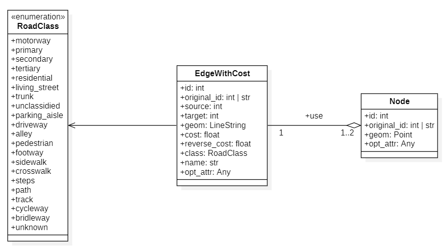

# User doc: Quality criteria and dashboard

This file provides information on how to use the Dashboard from scratch. It includes: formatting and preparing the database, adding a new area, downloading and integrating data into the database, launching, and using the Dashboard.

Refer to the [developer documentation](dev-doc.md) for information on how to add a criterion to the dashboard, for instance.

- [User doc: Quality criteria and dashboard](#user-doc-quality-criteria-and-dashboard)
- [Necessary components](#necessary-components)
  - [Database](#database)
    - [Common model](#common-model)
    - [Schemas](#schemas)
    - [Download PostgreSQL and PostGIS](#download-postgresql-and-postgis)
    - [Create the Database and Schemas](#create-the-database-and-schemas)
  - [Python](#python)
    - [Virtual Environment](#virtual-environment)
- [Quality Assessment](#quality-assessment)
  - [Adding Areas](#adding-areas)
  - [Custom Database Connection](#custom-database-connection)
  - [Download and Process Data](#download-and-process-data)
  - [Quality Assessment Criteria](#quality-assessment-criteria)
- [Dashboard](#dashboard)
  - [Run the Application](#run-the-application)
  - [Use the Application](#use-the-application)

# Necessary components

It was explained in another markdown, but to run the application, two main components are required:

- A PostgreSQL database with PostGIS extension;
- Python

## Database

For the database, the version information is documented in the [Readme.md](../Readme.md#database) file at the root of the repository, in the Database section.
This information is reiterated here:

| **Tool** | Version |
| --- | --- |
| **PostgreSQL** | 16.2 |
| **PostGIS** | 3.4 |
| **PgRouting** | 3.6.0 |
| **PgAdmin** | 8.4 |
| **DuckDB** | 0.10.2 |

The database used in this repository is:

- `name`: `pgrouting`
- `host`: `127.0.0.1`
- `port`: `5432`
- `user`: `postgres`
- `password`: `postgres`

These information can be changed by modifying the [.env](../.env) file directly.

### Common model

To compare OSM and OMF data, a common model was created (for transportation data), mainly based on the OMF transportation model. The model is as follows:



### Schemas

Four schemas are used in this database:

- `public`: The default schema, where PostGIS and PgRouting are installed. It also means that, to use these functions, the `public.` prefix must be used to avoid conflicts and problems. Additionally, the bounding box table is located in the public schema for easy access by the others.

- `osm`: As the name suggests, this schema contains all tables for OpenStreetMap data.

- `omf`: Similar to the `osm` schema, but for OvertureMaps Foundation data.

- `results`: As implied by its name, this schema contains the different results of quality assessment.

Using a single database with multiple schemas is more efficient than using multiple databases, as it is much easier to reference tables across schemas than across databases (at least with PostgreSQL).

This architecture can be represented with a UML diagram:


### Download PostgreSQL and PostGIS

The repository to download PostgreSQL is here: https://www.postgresql.org/download/.
Please install the correct version of PostgreSQL.
During the installation, one will be able to install PostGIS as well, so it should be done.

### Create the Database and Schemas

If PgAdmin is being used, one can easily add a new database.
Make sure to call it `pgrouting` to avoid having to change the database name in other files.
Otherwise, one can create a database in the command line, using psql:

Connect to the default database with the postgres user: `psql -U postgres`.

Enter the password.

Then, run this command to create the database: `CREATE DATABASE pgrouting;`, and run `\c pgrouting` to connect to the database.

Now, one can run these queries to create the schemas and extensions needed:

```sql
CREATE EXTENSION IF NOT EXISTS postgis;

CREATE EXTENSION IF NOT EXISTS pgrouting;

CREATE SCHEMA IF NOT EXISTS osm;

CREATE SCHEMA IF NOT EXISTS omf;

CREATE SCHEMA IF NOT EXISTS results;
```

*Note*: It is sufficient to create the database, as in the [data_integration.py](../src/Assessment/data_integration.py#L24), these SQL commands are executed (inside the `utils.initialisePostgreSQL()` function).

## Python

Python 3.12.3 has been used for the dashboard and data integration.
Python can be downloaded here: https://www.python.org/downloads/ (the operating system can be changed on this page as well).
Install it and add it to the PATH if Windows is being used.

### Virtual Environment

To prevent conflicts with other applications, it is recommended to use a virtual environment to install only the necessary dependencies in Python.
It is advisable to use an IDE such as VSCode and perform all tasks within the VSCode terminal.
This way, one will be able to select the virtual environment for Python files.
If multiple virtual environments are desired, one might create a folder to store the different virtual environments that will be created in the future.

To do so, run these commands after downloading Python:

**Create virtual environment**
```cmd
python -m venv .venv
.venv\Scripts\activate
```

**Activate / deactivate**

```cmd
.venv\Scripts\activate

.venv\Scripts\deactivate.bat
```

**Upgrade pip version**
```cmd
python.exe -m pip install --upgrade pip
```

**Install dependencies**

```cmd
pip install pip-tools && pip-compile Requirements\requirements.in && pip install -r Requirements\requirements.txt
```

Of course, it is necessary to adapt the path and names if any changes have been made.

*Note*: The download process may take between 10 and 20 minutes, but it should complete successfully.

# Quality Assessment

## Adding Areas

If the Python scripts are not modified, the areas used are those registered in the [bboxs.json](../Data/bboxs.json) file.
Here is a sample of this file:

```json
{
    "bboxs" : [
        {
            "bbox":"139.74609375,35.67514744,139.83398438,35.74651226",
            "area":"Tokyo"
        },
        {
            "bbox":"137.63671875,34.66935855,137.72460938,34.7416125",
            "area":"Hamamatsu"
        },
        {
            "bbox":"139.83398438,34.95799531,139.921875,35.02999637",
            "area":"Tateyama"
        },
        {
            "bbox":"141.07765453,39.6823863,141.16554516,39.75375112",
            "area":"Morioka"
        },
        {
            "bbox":"130.68726409,32.72948989,130.77515472,32.80174385",
            "area":"Kumamoto"
        },
        {
            "bbox":"132.69418348,34.38622724,132.7820741,34.45848119",
            "area":"Higashihiroshima"
        },
        {
            "bbox":"2.289261,48.828241,2.395691,48.899046",
            "area":"Paris"
        }
    ]
}
```

If modifications to these areas are desired to download data from other locations, the file can be updated accordingly.
The important part is to only add elements to the `bboxs` array.
Each element has two mandatory attributes:

- `bbox`: The bounding box of the area, in CSV format. Data will be extracted from this area. The [bounding box tool](https://boundingbox.klokantech.com/) can be used to easily create a bounding box, and the result can be copied and pasted directly into CSV format. Currently, extended areas are not readily available, so it is recommended to use bounding boxes of approximately 8 x 8 km. Direct measurement on the bounding box tool is not possible, but [this website](https://www.freemaptools.com/measure-distance.htm) can be used to approximately measure the bounding box. Ensure there are no spaces between numbers and commas.

- `name`: The name of the area. It should start with a capital letter, and the remaining characters must be in lowercase. No spaces or special accents should be used. Although inconvenient, this constraint is currently unavoidable. Additionally, the name should be unique to avoid issues during processing.

All areas listed in this file will be downloaded and used in the other scripts, so remove any that are not desired for download. If an area has already been downloaded, there will be no issues.

## Custom Database Connection

In the Python files, the database connection can take one of three forms:

- `connection = utils.getConnection()`: Connection used by the psycopg2 package.

- `engine = utils.getEngine()`: Engine used by GeoPandas (for querying the database).

- `initialiseDuckDB()`: Initializes DuckDB and connects it to a PostgreSQL database.

These functions are defined in the [utils.py](../src/Utils/utils.py) script.
They require one argument, a path to a `.env` file. If no path is provided, the default path will be:

```python
os.path.join(os.getcwd(), '.env')
```

This value corresponds to a `.env` file located in the same directory as the one from which the Python file is being run.
It is located [here](../.env).
If the Python file is being run from the root of the project, this should not be a problem.
However, if it is not, the path to the `.env` file will need to be specified in every Python script, which can be inconvenient.

The connection parameters are:

- `POSTGRES_DATABASE`: Name of the database. Defaults to `pgrouting`.

- `POSTGRES_HOST`: IP address of the host. Defaults to `127.0.0.1`.

- `POSTGRES_USER`: User name. Defaults to `postgres`.

- `POSTGRES_PASSWORD`: Password. Defaults to `postgres`.

- `POSTGRES_PORT`: Port to connect to. Defaults to `5432`.

The same environment file is used for the data integration, quality assessment, and application processes.

## Download and Process Data

Data corresponding to the chosen areas can be downloaded using the [data_integration.py](../src/Assessment/data_integration.py) script.
Certain attribute values in this file can be modified, such as:

- [`createBoundingBoxTable`](../src/Assessment/data_integration.py#L20): If `True`, it will create the bounding box table, even if it has already been created. Defaults to `True`.

- [`skip<theme>Check`](../src/Assessment/data_integration.py#L58): If `True`, it will recreate all layers of each area for the specified theme (one of `Graph`, `Building`, or `Place`). Otherwise, layers will be created only if they have not been created yet. Defaults to `False`.

- [`ox.settings.overpass_settings`](../src/Assessment/data_integration.py#L38): This setting is used to limit OSM data to a specific date. The default date is `2024-06-07T23:59:59Z`. This date can be changed if desired, but it is preferable to select a date approximately the same as the one used by the `overturemaps.py` tool (the default date corresponds to the 2024-06-13-beta.1 release).

Normally, no additional changes should be necessary (such as altering template names for the layer, schema names, or the path to the bbox file, etc.).
If changes are required, they should be made consistently across the different files.

The script can be run with this command:

```cmd
python Python\Assessment\data_integration.py
```

Or directly by running the script in an IDE of choice.

## Quality Assessment Criteria

Once the data has been downloaded, the necessary scripts can be run to assess the quality of the different layers.
Currently, the criteria are focused on graph data. The Python script is [quality_assessment.py](../src/Assessment/quality_assessment.py), that uses the function in the [quality.py](../src/Assessment/quality.py) script.

Certain attribute values can be modified, such as:

- [`fileName`](../src/Assessment/quality_assessment.py#L20): The name of the markdown file that will be produced. Defaults to `Automatic_result.md`.

- [`pathSave`](../src/Assessment/quality_assessment.py#L22): The path to save the markdown file. If the folder does not exist, an error will be returned. Defaults to `./Data/Results/<fileName>`, where `<fileName>` is the previously mentioned variable.

- [`bounding_box_table`](../src/Assessment/quality_assessment.py#L59): The name of the bounding box table in the public schema of the database. Defaults to `bounding_box`.

Other variables can also be changed, but this is not recommended, especially since changes would need to be updated in the dashboard as well.

As with the previous script, this script can be run with this command:

```cmd
python Python\Assessment\quality_assessment.py
```

Or directly by running the script in an IDE of choice.
Calculating everything may take some time, but the results will be printed to the console.

# Dashboard

## Run the Application

To run the application, since the requirements are already downloaded, one can simply use this command:

```
shiny run .\Python\Web\Dashboard\app.py
```

Then, open your browser and navigate to [http://127.0.0.1:8000](http://127.0.0.1:8000).

## Use the Application

To use the application, refer to the `Help` panel within the application or consult the [help.md](../src/GeoDataCompare/help.md) file directly.