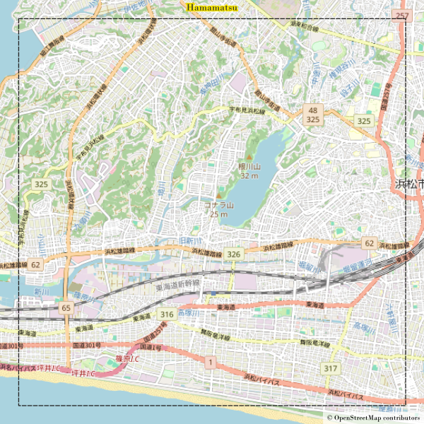
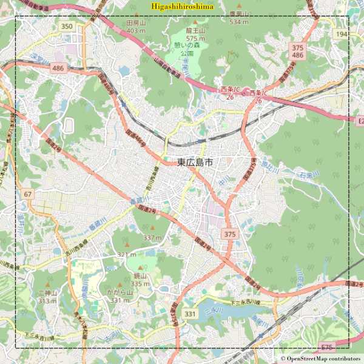
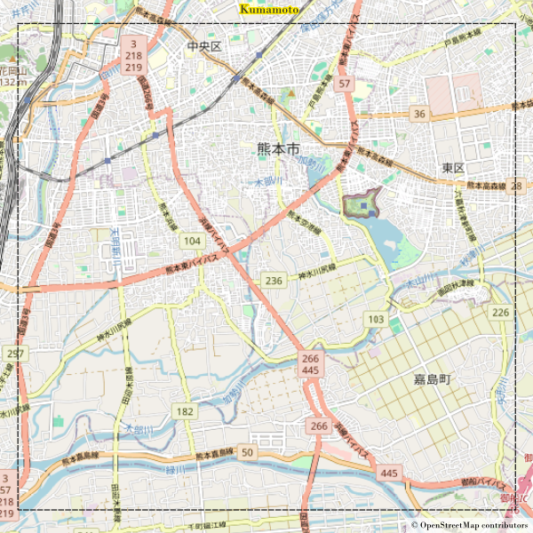
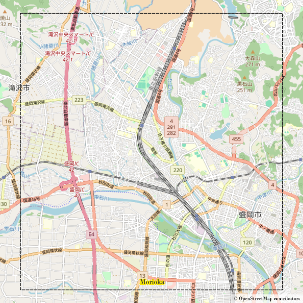
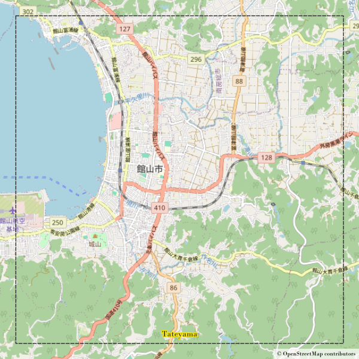
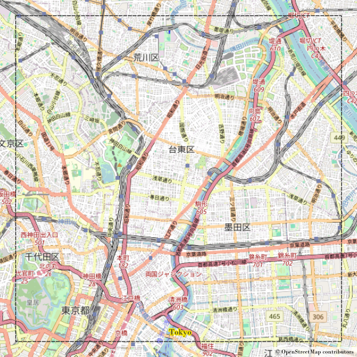

# OSM_Overture_Works

|   |   |
|:---:|:---:|
| Main  |   |
| Dev  |   |
| Last commit |  |

- [OSM\_Overture\_Works](#osm_overture_works)
- [Goal of this internship](#goal-of-this-internship)
- [Repository structure](#repository-structure)
  - [Data](#data)
  - [Documentation](#documentation)
  - [Python](#python)
- [Database](#database)
  - [Schemas](#schemas)
  - [Table names](#table-names)
- [Bounding box used to test algorithms:](#bounding-box-used-to-test-algorithms)
- [License](#license)
- [Credits](#credits)

This project has been created for an internship at the [ENSG-Géomatique](https://ensg.eu/fr) school, for [LocationMind Inc.](https://locationmind.com/).

# Goal of this internship

The goal of this internship is to compare and assess quality of two open sources dataset : [OpenStreetMap](https://www.openstreetmap.org/) and [OvertureMap Fundation](https://overturemaps.org/).
A lot of data is available on these datasets, so the study focuses on building and road network data.
In the rest of this document, OSM, respectively OMF, will be used for OpenStreetMap, respectively OvertureMap Fundation.

# Repository structure

The repository have 3 main folders :

- [*Data*](#data): contains data such as bounding boxes used for testing the code or QGIS project to visualise data;

- [*Documentation*](#documentation): contains several markdown documents explaining different things such as how to download data, mapping OSM classes to OMF classes or the different criteria for graph analysis;

- [*Python*](#python): contains all python scripts, including test scripts.

The two files [requirements.in](requirements.in) and [requirements.txt](requirements.txt) are used for control version.

## Data

It is obviously impossible and useless to download OSM and OMF data over countries like Japan and then load them in this folder on GitHub.
Therefore, data in *Data* folder are not references data.

Inside [*Bbox*](./Data/Bbox/) subfolder, information about the bboxs used are provided, either in a csv format or in a JSON format.

Inside [*QGIS*](./Data/QGIS/) subfolder, a QGIS project is available.
It is used to see the graph analysis over the different areas by cnnnecting each layer to the database (more information on this database in the [database](#database) section).
QGIS layer style files are also included in this subfolder.

Inside [*Results*](./Data/Results/) subfolder, different kind of results are provided, mainly results from the python scripts.

## Documentation

This folder contains a lot of different documentations from data modelisation to graph analysis.
The [*Images*](./Documentation/Images/) subfolder contains all the images used in the GitHub project (mainly for documentations files).

Documents are explained here:

- [Internship_reformulation](./Documentation/Internship_reformulation.md): Document providing a reformulation of the internship, created at the beginning of the internship so not up to date.

- [Data_modelisation](./Documentation/Data_modelisation.md): Data model, created with both OSM and OMF documentation.

- [OSM_PgRouting](./Documentation/OSM_PgRouting.md): Explains how to download and transform OSM data using OSMnx tool, especially to use PgRouting with it.

- [Openstreetmap_h3_Test_Review](./Documentation/Openstreetmap_h3_Test_Review.docx): Written by Mathieu MARGOLLE, it show and to use openstreetmap_h3 tool to download and process data over all Japan.
openstreetmap_h3 tool has not been used for integrating any kind of data, but the process of edges and node creations have been used for OMF data integration. 

- [OvertureMap_data](./Documentation/OvertureMap_data.md): Explains how downloading OvertureMap data and why we need to transform it to use PgRouting with it.
As mentionned before, it uses the same process than [Openstreetmap_h3_Test_Review](./Documentation/Openstreetmap_h3_Test_Review.docx) document, adapted for OMF data.

- [Mapping_OSM_to_OMF](./Documentation/Mapping_OSM_to_OMF.md): Explains how to map OSM data to have the same classes than OMF, by using combination of several tags.

- [Comparison-OSM-OvertureMap_PgRouting](./Documentation/Comparison-OSM-OvertureMap_PgRouting.md): Uses the previous documents and results to analyse the road network over several places.
The first part of this document focuses on the process and the other part is about results.
Only 3 areas have been made with that and it was with the May release of OvertureMap, so results might be slightly different from other documents and results in this repository.

- [Research_paper](./Documentation/Research_paper.md): Notes taken for different research papers about quality assessment for example.

## Python

All python files are in this folder.

In [*PyQGIS*](./Python/PyQGIS/) subfolder are scripts that have been used with PyQGIS, the python API for QGIS.
For the moment, only corresponding nodes calculation and overlap indicator are calculated using PyQGIS.
It is not necessary now to use them as the database structure has changed and it is now easier to use data from both datasets with easy SQL queries.

In [*Test*](./Python/Test/) subfolder are test scripts.
There are not many tests that have been made for the moment but more test are going to be created.

Other scripts are:

- [utils.py](./Python/utils.py): Provides useful functions that are used in other scripts too, such as database connection or function to run sql queries.

- [osm_pgrouting.py](./Python/osm_pgrouting.py): Provides functions to download and integrate OSM data into a database, using bbox indicated in [bboxs.json](./Data/Bbox/bboxs.json) file.

- [data_integration.py](./Python/data_integration.py): Provides functions to download OvertureMap Fundation data from a bbox using the overturemaps python tool.
It also download and integrate data in the database.

- [overtureMap_data_to_graph.py](./Python/overtureMap_data_to_graph.py): Provides functions to extract data from pre-integrated OMF data, using bbox indicated in [bboxs.json](./Data/Bbox/bboxs.json) file.
Results are saved into the database and are compatible with PgRouting.

- [graph_analysis.py](./Python/graph_analysis.py): Provides functions to calculate quality criteria for graph analysis, such as number of nodes or edges, overlap indicator etc.
All these criteria are described in this document: [Comparison-OSM-OvertureMap_PgRouting.md](./Documentation/Comparison-OSM-OvertureMap_PgRouting.md).

Except for the [utils.py](./Python/utils.py) file, all the other scripts needs to be run in this order (you can invert OSM and OMF data integration of course) so the graph analysis can be runned.

It is thanks to the bbox JSON file that all can be done automatically, so please update it if you want to work on different areas for instance.

# Database

Data integration and quality assessment revolve around a database.
The version of the different database tools used are:

| **Tool** | Version |
| --- | --- |
| **PostgreSQL** | 16.2 |
| **PostGIS** | 3.4 |
| **PgRouting** | 3.6.0 |
| **PgAdmin** | 8.4 |
| **DuckDB** | 0.10.2 |

The database used in this repository is:

- `name`: `pgrouting`
- `host`: `127.0.0.1`
- `port`: `5432`
- `user`: `postgres`
- `password`: `postgres`

## Schemas

4 schemas are used in this database:

- `public`: Defaults schema, where PostGIS and PgRouting are installed.
It also means that to use these function, the `public.` prefix has to be used to avoid conflict and problems.
Also, the bounding box table is located in the public schema, to be used by the other one easily.

- `osm`: As the name indicates it, this schema contains all tables for OpenStreetMap data. This include data directly integrated with OSMnx or data compatible with PgRouting.

- `omf`: Same than the `osm` schema, but for OvertureMap Fundation data. More tables are created due to the OMF data integration process, and road and connectors for all Japan are also integrated in this schema.

- `results`: The name also speaks for itself, this schema contains the different results of quality assessment for instance.

Using only one database with multiple schemas is better than using multiple ones as it is way easier to use tables from different schemas than table from different database (at least it is the case with PostgreSQL).

## Table names

For either OSM or OMF data, the tables have templates names for their final usage with PgRouting:

- Table of edges with cost : `edge_with_cost_<area>`;

- Table of nodes : `node_<area>`;

where `<area>` correspond to the area name, like `tokyo` or `higashihiroshima`.

To access OSM data, only the `osm` prefix needs to be used, same for OMF data with `omf` prefix.

# Bounding box used to test algorithms:

Assessinq quality of OSM and OMF datasets over entire Japan is complicated and take some time, so in order to do so, some tests have been run on different areas.
Among these areas, some are urban, other rural and other are sub-urban areas.
The name of these areas and their bbox are provided here.
For more clarity, pictures of these areas are also included.
All these information can also be found directly on the [bboxs.json](./Data/Bbox/bboxs.json) file.

- **Hamamatsu**: `137.63671875,34.66935855, 137.72460938,34.7416125`

- **Higashihiroshima**: `132.69418348,34.38622724, 132.7820741,34.45848119`

- **Kumamoto**: `130.68726409,32.72948989,130.77515472,32.80174385`

- **Morioka**: `141.07765453,39.6823863,141.16554516,39.75375112`

- **Tateyama**: `139.83398438,34.95799531, 139.921875,35.02999637`

- **Tokyo**: `139.74609375,35.67514744,139.83398438,35.74651226`

# License

Because of OpenStreetMap license ([Open Data Commons Open Database License](https://opendatacommons.org/licenses/odbl/)), all the work done with OSM data must be release with the same license.
OvertureMap Fundation might have different licenses (see [here](https://docs.overturemaps.org/attribution/)), but it uses OpenStreetMap data too, especially for building and road network data.
Therefore, all of this work is under the [Open Data Commons Open Database License](https://opendatacommons.org/licenses/odbl/).

# Credits

Without other explicit credits, all maps data are from [OpenStreetMap](https://www.openstreetmap.org/copyright).
The data displayed from these maps are either from [OpenStreetMap](https://www.openstreetmap.org/copyright) or from [Overture Maps Foundation](https://docs.overturemaps.org/attribution/), depending on the picture.
Usually, the type of data (OSM or OMF or both) is described in the context of the picture.